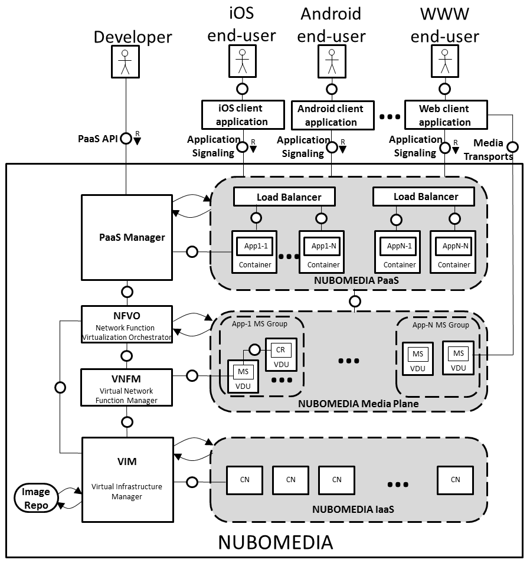
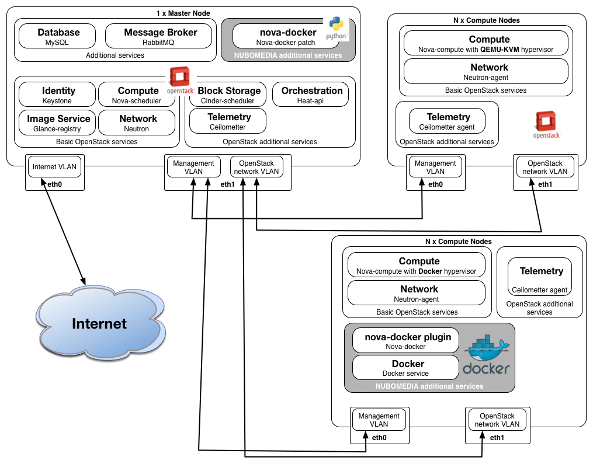

# NUBOMEDIA Architecture

The NUBOMEDIA architecture complies with the ETSI (European Telecommunications
Standards Institute) NFV MANO (Network Function Virtualization Management and
Orchestration)
[specification](http://www.etsi.org/deliver/etsi_gs/NFVMAN/001_099/001/01.01.01_60/gs_nfv-man001v010101p.pdf).
The following picture shows this architecture created using [Fundamental
Modeling Concepts (FMC)](http://www.fmc-modeling.org/).

*NUBOMEDIA Architecture*

## PaaS Manager

The PaaS Manager is the part of the system enabling developers to deploy and
manage their server-side applications. The PaaS Manager is the component in
charge of the full lifecycle of a NUBOMEDIA application, defined as a
combination of the server-side application logic, hosted on the PaaS, and its
required media functions, hosted on the NUBOMEDIA Media Plane, and NUBOMEDIA
IaaS.

Take a look the [PaaS Manager page](../paas/paas-introduction.md) for further
details on this component, and also about the [PaaS API](../paas/paas-api.md)
and the [PaaS GUI](../paas/paas-api.md).

## NUBOMEDIA PaaS

The NUBOMEDIA PaaS hosts the server-side application logic on top of on demand
deployed Application Servers . For this, it needs to provide a set of services
to the PaaS Manager, which mediates between developers and the PaaS. These
services must make possible to deploy, scale and manage the application
lifecycle. The NUBOMEDIA PaaS architecture comprise a number of building
blocks, which are the following:

- Core services: authentication, data store, scheduler, management/replication

- APIs: The core services of the NUBOMEDIA PaaS are provided as
  micro-services. Micro-services is a software architecture approach in which
  complex applications are split into small independent processes which
  communicate among each other using language agnostic APIs.

- Containers, pods and nodes: Containers are the basic unit of NUBOMEDIA PaaS
  applications. A container corresponds with the Linux notion of containers as
  a lightweight mechanism for isolating running processes. The NUBOMEDIA PaaS
  uses [Docker containers](http://www.docker.com). Nodes, in turn, are worker
  machines, physical or virtual, where pods are run. Following Kubernetes
  terminology, a pod is an application logical host in a containerized
  environment. In other words, pods are collocated groups of containers that
  make up the application.

  - Registry. The registry is a service for storing and retrieving Docker
  images. It contains a collection of Docker image repositories. In the case of
  NUBOMEDIA, all applications are deployed using Docker containers and the PaaS
  provides an internal registry for managing custom Docker images.

## Network Function Virtualization Orchestrator (NFVO)

Each time a developer requests the instantiation of an application, the PaaS
Manager firstly requests the deployment of a set of Virtualized Network
Functions (VNF), defined as Network Service, then instantiates the application
on the PaaS providing all the details of the media functions that are dedicated
to it. [NFV](https://portal.etsi.org/nfv/nfv_white_paper.pdf) (Network
Functions Virtualization) is designed to consolidate and deliver the networking
components needed to support a fully virtualized infrastructure, including
virtual servers, storage and even other networks.

The Network Function Virtualization Orchestrator (NFVO) is the component
managing the lifecycle of a Network Service (NS) composed by multiple Media
Server (MS) and a Cloud Repository (CR).

## Virtual Network Function Manager (VNFM)

The Virtual Network Function Manager (VNFM) provides lifecycle management for a
Virtualized Network Function (VNF). On the one hand, the MS-VNFM is specific
and its functionalities are adapted to managing Media Server functions. On the
other hand, the Cloud Repository one (CR-VNFM) is based on a generic
architecture.

The MS-VNFM provides an API to applications deployed in the NUBOMEDIA PaaS for
retrieving dynamically the available Media Servers. This API is consumed by the
NUBOMEDIA Media API implementation to determine in which specific Media Server
instance a newly created Media Pipeline is placed. Allocating new Media
Pipelines is transparent to the developer, who just needs to create the Media
Pipelines without worrying about where they are located. For this, the VNFM has
been extended with the autoscaling component, providing semantics to that
placement interface and guaranteeing the availability of Media Servers through
an horizontal autoscaling mechanism based on two operations: scaling-out (i.e.
to add resources when necessary) and scaling-in (i.e. to remove resources when
they are no longer required). Both, the scaling-in and -out, are fired by
simple autoscaling policies based on QoS metric thresholds, so that, for
example, further resources are added when the average CPU load of Media Server
instances is over an upper limit and resources are collected when it’s under a
lower bound.

## Virtual Infrastructure Manager (VIM)

The Virtual Infrastructure Manager (VIM) provides an interface for controlling
the NUBOMEDIA IaaS. As in the ETSI NFV specification, the VIM follows the
OpenStack approach and, through its APIs, offers the ability to start new
computing resources by using already pre-configured images containing the
appropriate artifacts for every of the required functions. The computing nodes
are instantiated on the NUBOMEDIA IaaS on top of one or more Compute Nodes.
Computing nodes are distributed across physical machines depending on the
required flavors and resources.

## NUBOMEDIA Media Plane

The NUBOMEDIA Media Plane provides the media capabilities to NUBOMEDIA
applications. These capabilities include media transport, media archiving and
media processing. The scalability of the NUBOMEDIA Media Plane is controlled by
the NFVO component, which adapts it to the load offered by applications.

### Media Server

A Media Server (MS) comprises a number of Media Pipelines (MPs). MPs are graphs
of interconnected Media Elements (MEs). Each ME implements a specific media
capability: media transport, media archiving or media processing.

A ME can be seen as a black box taking media from a sink, applying a specific
media capability (e.g. processing, transporting, etc.), and issuing media
through a source. MEs have different flavors (i.e. types) in correspondence
with their different specialties (e.g. RtpEndpoint, RecorderEndpoint,
FaceDetectorFilter, etc.).

### Media Repository

The Cloud Repository provides scalable archiving capabilities to NUBOMEDIA. The
Cloud Repository is able to store Repository Items, which comprise multimedia
data and metadata. Repository Items can be recovered later querying them
through ID or through any kind of information present into its metadata.
Repository Item metadata consists on arbitrary JSON, which is quite convenient
for developers.

## NUBOMEDIA IaaS

NUBOMEDIA PaaS hides the underlying complexity of an IaaS platform that enables
developers to build multimedia applications without infrastructure knowledge.
The elastic nature of the IaaS enables developers to build multimedia apps that
scale easily with an increase of usage. IaaS capabilities are exposed through
APIs that are used by the Virtual Infrastructure Manager to provide hardware
resources to the upper levels of the NUBOMEDIA IaaS.

The NUBOMEDIA IaaS is based on OpenStack and has two types of compute nodes.
Some of the compute nodes are based on QEMU-KVM hypervisor and the other types
of compute nodes are running Docker containers using the nova-docker plugin.

The main services of OpenStach which have been deployed for NUBOMEDIA are:
Nova, Neutron, Glance, Cinder, Keystone and Horizon. All the services running
on the IaaS level are available through certain end-points which are following
OCCI-OGF standards.

For enabling of rapid deployment of new Media Server instances by the MS-VNFM,
we created a nova-docker patch that pulls all docker container images available
on Glance on all compute nodes running the Docker as a hypervisor. This way the
instantiation of new Docker containers inside the IaaS is done in less than one
second. The IaaS architecture is presented in the following diagram.

*IaaS Architecture*

