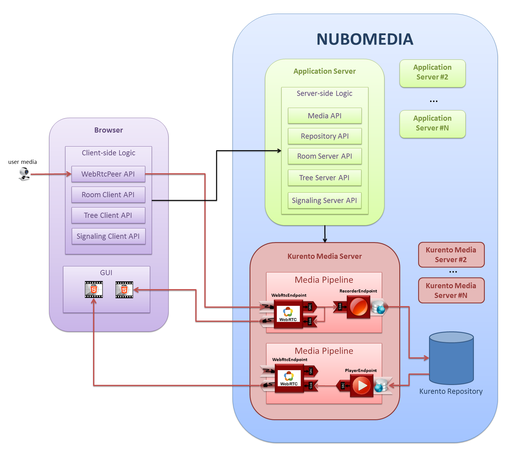
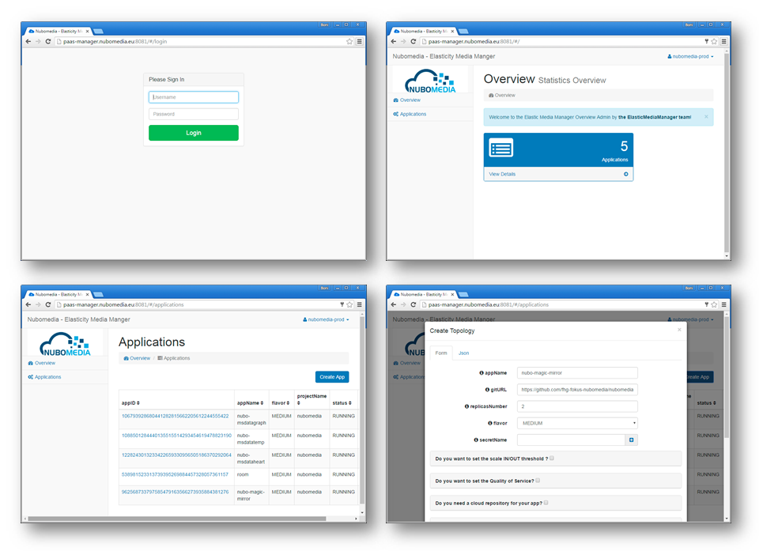
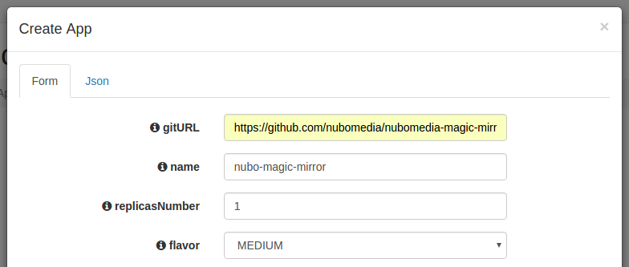
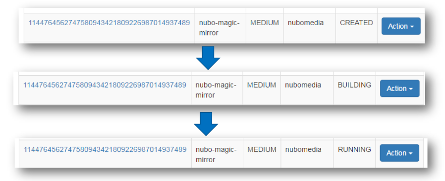
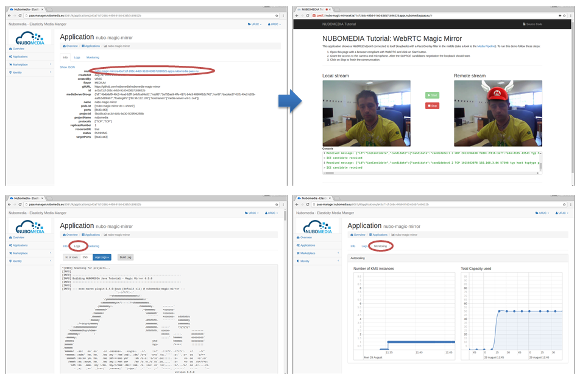

# First contact with NUBOMEDIA

At the heart of NUBOMEDIA we find the **Kurento Media Server** (KMS). KMS provides media capabilities to the NUBOMEDIA platform that can be used for creating a cloud media plane with the appropriate media capabilities and suitable for working with elastic scalability. This means that the number of KMS's is controlled by the NUBOMEDIA PaaS, scaling in and out depending on the load of the system.

Therefore, the first step to become a NUBOMEDIA developer, it is important to get in touch with Kurento. To that aim, it is recommended to take a look to the [Kurento documentation](http://doc-kurento.readthedocs.io/). A simple way to learn about Kurento is to follow these steps:

1. Read and understand the [Kurento basis](http://doc-kurento.readthedocs.io/en/stable/introducing_kurento.html)
2. [Install KMS](http://doc-kurento.readthedocs.io/en/stable/installation_guide.html) in your local machine (Ubuntu)
3. Run the [kurento-hello-wold](http://doc-kurento.readthedocs.io/en/stable/tutorials/java/tutorial-helloworld.html) Java tutorial in your local environment

Once you completed this process, the next step is to use NUBOMEDIA to deploy and leverage our application in a cloud environment. In short, you can see NUBOMEDIA as a development platform with different scaffolding technologies:

- The **NUBOMEDIA APIs and SDKs**. NUBOMEDIA has been made for developers, and so, on the one hand a complete set of Java APIs is provided. On the other hand, SDKs for mobile development (for Android and iOS) is also provided out of the box by NUBOMEDIA. Above in this page you can find an overview of the different APIs and SDKs, which are explained in detail in next sections of this documentation. 
- The **NUBOMEDIA PaaS Manager**. The PaaS manager can be seen as a tool aimed to control the way in which the NUBOMEDIA applications are built and deployed inside the NUBOMEDIA PaaS. Please keep reading to find more details. 

# NUBOMEDIA APIs and SDKs

From the developer’s perspective, NUBOMEDIA capabilities are accessed through a set of APIs. Hence, for creating NUBOMEDIA applications, developers just need to understand these NUBOMEDIA Development APIs so that they may use them for creating their rich RTC media applications. NUBOMEDIA offers a complete set of APIs that can be classified in three groups:

- **Media Capabilities APIs**. These APIs expose to the application logic the low-level media capabilities of NUBOMEDIA: [Media](./api/media.md), [WebRtcPeer](./api/webrtcpeer.md), and [Repository](./api/repository.md) API.
- **Signaling APIs**. The media capabilities APIs (Media, WebRtcPeer, Repository API) are signaling agnostic, meaning that they neither require nor assume any kind of specific characteristic for signaling. Hence, NUBOMEDIA capabilities can be accessed through any kind of signaling protocol including SIP, XMPP or REST. However, for simplifying common development tasks, NUBOMEDIA provides a simple [Signaling](./api/signaling.md) API based on JSON-RPCs that is suitable for most applications not requiring specific interoperability features.
- **Abstract Communication APIs**. Developers typically use RTC media capabilities for creating applications devoted to person-to-person communications. In this case, the application business logic needs to manage the communication topologies among participants in an RTC multimedia session. In the general case, this logic needs to be programmed by the application developers. However, there are a number of communication topologies that are quite  popular and appear systematically in applications. Due to this, in our architecture, we propose specific communication API abstracting the low level details of the media logic on these topologies so that developers may use them in an agile and efficient manner. In particular, we have identified two of these common topologies: the [Room](./api/room.md) and the [Tree](./api/tree.md) topology.

All in all, NUBOMEDIA offers six different APIs. The following table provides a brief summary of these APIs:

API                                   | Description
--------------------------------------| -----------
[Media API](./api/media.md)           | Enables developers consuming the **Media Server** capabilities among which we can find media transport, media archiving, media processing, media transcoding, etc.
[WebRtcPeer API](./api/webrtcpeer.md) | Abstracts the **client WebRTC** media capabilities, exposing the media capture and communication capabilities of a browser in a simple, seamless and unified way
[Repository API](./api/repository.md) | Makes possible to access an elastic scalable **media repository** for archiving media information and meta-information
[Signaling API](./api/signaling.md)   | Provides a simple signaling mechanism based on **JSON-RPCs** for applications. This API has can be used both in the application-server and in the client side
[Room API](./api/room.md)             | Enables application developers functionalities to create **group communication** applications adapted to real social interactions. This API has can be used both in the application-server and in the client side
[Tree API](./api/tree.md)             | Allows developers to build video **broadcasting** web applications. This API has can be used both in the application-server and in the client side

In addition, NUBOMEDIA offers a complete SDK to create mobile applications consuming the media capabilities provided by the NUBOMEDIA applications. You can find the following SDKs:

SDK                             | Description
--------------------------------| -----------
[Android SDK](./sdk/android.md) | **Android** version of the client-side NUBOMEDIA APIs: WebRtcPeer, Signalling, Room, Tree
[iOS SDK](./sdk/ios.md)         | Complete SDK to provide NUBOMEDIA client capabilities to **iOS** devices

This set of APIs/SDKs is inspired by the popular Web three tier model. In this model, we can distinguish three layers:

- The *Client*, typically which consists on a web browser executing the client-side application logic. This logic is typically developed using programming languages such HTML and JavaScript, and with the help of specialized third party APIs (e.g. Angular, Bootstrap, etc.)
- The *Application Server (AS)*, which hosts the server-side application logic. This layer typically contains the business logic of the application.
- The *Service Layer* comprise a number of services that are required for the application to work. In NUBOMEDIA, this layer is composed by a set of **Media Servers** (namely, [Kurento Media Server](http://doc-kurento.readthedocs.io/en/stable/introducing_kurento.html)) and a **Media Repository**  (i.e. the [Kurento Repository](http://doc-kurento-repository.readthedocs.org/)).

In the following diagram we can see how the different NUBOMEDIA APIs/SDKs fits in this three-tier model:



*NUBOMEDIA Tree Tier Model (clients -- application-server -- service-layer)*

# NUBOMEDIA PaaS Manager

NUBOMEDIA is a PaaS, as therefore it makes possible to upload, deploy and execute developers’ applications written in the **Java programming language** with the NUBOMEDIA APIs described before. NUBOMEDIA PaaS elastically provides the **service layer infrastructure** (i.e. the needed instances of KMSs and a Media repository if needed) depending on the load of the system.

The capabilities provided by the Paas Manager can be used by developers in two ways:

1. Using the PaaS GUI. The PaaS Manager GUI is a web application that allow to use the NUBOMEDIA PaaS Manager. This application can be found in the following [link](http://paas-manager.nubomedia.eu:8081/) (the snapshots below show some examples of this GUI). The NUBOMEDIA project manages a NUBOMEDIA PaaS instance that is reserved to the institutions being part of the project. If you are not part of the NUBOMEDIA project but you want to use NUBOMEDIA you should install your very own PaaS following the [installation instructions](./tools/autonomous-installer.md).
2. Using the PaaS Manager API. In addition to the GUI, the PaaS Manager exposes its capabilities by means of a REST API. Please take a look to the [PaaS API](./paas/paas-api.md) documentation for further details.



*NUBOMEDIA PaaS Manager GUI Snapshots*

The **application server** is also provided by the NUBOMEDIA PaaS. Due to the fact that the applications are made in Java, we recommend to use [Spring-Boot](http://projects.spring.io/spring-boot/) as the application server side technology. Spring-Boot embeds a Tomcat server in a simple seamless way for developers. Please take a look to the [tutorials](./tutorial/nubomedia-magic-mirror.md) for examples.

# Using Maven for NUBOMEDIA applications

As depicted before, NUBOMEDIA provides a complete set of **Java APIs** for developers. For this reason, it is highly recommended to use a build automation tools for the Java projects, such as **Maven**.

[Maven](https://maven.apache.org/) is a build automation tool used primarily for Java projects. It addresses two aspects of building software: first, it describes how software is built (i.e. it handles the build lifecycle), and second, it describes its dependencies. Maven embraces the idea of Convention over Configuration, that is, Maven provides default values for the project's configuration:

Maven project example snapshot                                     | Structure description
-------------------------------------------------------------------| ----------------------
 | - The project root contains the `pom.xml`. This file (Project Object Model, POM) provides all the configuration for the project <br><br> - `src/main/java`: Contains the Java source code <br><br> - `src/main/resources`: Contains the resources for the project (e.g. property files, images, etc) <br><br> - `src/test/java`: Contains the testing Java source code (e.g. JUnit test cases) <br><br> - `src/test/resources` : Contains resources for testing <br><br> - `target`: This folder is used to house all output of the build

The central piece of a Maven project configuration is the file `pom.xml`. An example is as the following:

```xml
<project xmlns="http://maven.apache.org/POM/4.0.0" xmlns:xsi="http://www.w3.org/2001/XMLSchema-instance"
	xsi:schemaLocation="http://maven.apache.org/POM/4.0.0 http://maven.apache.org/xsd/maven-4.0.0.xsd">

	<!-- model version is always 4.0.0 for Maven 2.x POMs -->
	<modelVersion>4.0.0</modelVersion>

	<!-- project coordinates, i.e. a group of values which uniquely identify
		this project -->
	<groupId>eu.nubomedia.example</groupId>
	<artifactId>maven-project-example</artifactId>
	<version>1.0.0</version>

	<!-- library dependencies -->
	<dependencies>
		<!-- coordinates of the required library -->
		<dependency>
			<groupId>junit</groupId>
			<artifactId>junit</artifactId>
			<version>4.12</version>
			<scope>test</scope>
		</dependency>
	</dependencies>
</project>
```
The clauses `groupId`, `artifactId`, and `version` are known as the project coordinates. This information identifies uniquely a project:

- `groupId` : project group (e.g. `com.mycompany.mydivision`)
- `artifactId` : project name (e.g. `myproject`)
- `version` : project version. We recommend to use [semantic versioning](http://semver.org/)

Each clause `dependency` identifies the library used by the Maven project using their coordinates. By default, these dependencies are downloaded from the [Maven Central repository](http://search.maven.org/) and stored in the local repository (located at `~/.m2/repository`). Each dependency can be configured using the `scope` clause. This value is used to limit the classpath and transitivity of a dependency. The most important scope values are the following:

- `compile`: This is the default scope, used if none is specified. Compile dependencies are available in all classpaths of a project
- `test`: This scope indicates that the dependency is not required for normal use of the application, and is only available for the test compilation and execution
- `provided`: A dependency declared using this scope will be required in compilation time but not in runtime.  For example, when building a web application for the Java EE, you would set the dependency on the Servlet APIto scope provided because the web container provides that library

Maven is based around the central concept of a build lifecycle. For the developer building a project, this means that it is only necessary to learn a small set of commands to build any Maven project, and the POM will ensure they get the results they desired. Each build in a Maven project is defined by a different list of build phases, wherein a build phase represents a stage in the lifecycle. The default phases in a build are the following:

- `validate`: validate the project is correct and all necessary information is available
- `compile`: compile the source code of the project
- `test`: test the compiled source code using a suitable unit testing framework
- `package`: take the compiled code and package it in its distributable format, such as a JAR
- `verify`: run any checks on results of integration tests
- `install`: install the package into the local repository
- `deploy`: done in the build environment, copies the final package to the remote repository for sharing with other developers and projects

# Running your first NUBOMEDIA application

Now let's see how to deploy an application on the NUBOMEDIA PaaS. It can be done by creating the application from the scratch, but in order to make this process easier, we recommend to use one the NUBOMEDIA tutorials as template, evolving the code according to the specific needs of your app. If you are using the [Media API](./api/media.md), you can use the [magic-mirror tutorial](./tutorial/nubomedia-magic-mirror.md) to run your first application on NUBOMEDIA. Before doing that, please be aware of the following tips:

- We recommend [Spring-Boot](http://projects.spring.io/spring-boot/) as the base technology for NUBOMEDIA applications. Spring-Boot embeds a Tomcat server in a simple seamless way for developers. The application is packaged as a runnable JAR, and when this JAR is executed, the Tomcat server is started and the web application automatically deployed.

- We recommend [Maven](https://maven.apache.org/) as for managing the life-cycle and managing the dependencies of our applications.

- We use [GitHub](https://github.com/) to host the applications that are going to be deployed on NUBOMEDIA.

- Internally, the NUBOMEDIA PaaS uses [Docker](https://www.docker.com/) containers to deploy applications.

Said that, a NUBOMEDIA application is basically a Java project that uses some of the NUBOMEDIA APIs and it can be deployed in the NUBOMEDIA PaaS. In order to configure the deployment, a file called `Dockerfile` should be located in the root of the repository (see [reference documentation](https://docs.docker.com/engine/reference/builder/) for more details).

Now let's see the example ([magic-mirror tutorial](./tutorial/nubomedia-magic-mirror.md)). Once logged in the PaaS Manager, we have to click on the *Create App* button inside the *Applications* section and provide the GitHub URL of our project, in our case this URL is the following:

```
https://github.com/nubomedia/nubomedia-magic-mirror
```

Please visit the documentation page about [PaaS Manager](./paas/paas-introduction.md) for further information about the meaning of the rest of configuration values. The most important values are illustrated in this picture:



*PaaS Manager Settings for Magic Mirror Tutorial*

Then we need to click on the `Create App` button. The deployment should start, changing the state from `CREATED` to `RUNNING` (it takes a couple of minutes to finish):



*PaaS Manager deployment states*

Once the deployment is finished (i.e., in the state `RUNNING`) we will be able to open the application by clicking on the provided URL by the PaaS. In addition, build and application logs can be accessed in order to trace our application, and monitoring charts are displayed to trace the resources consumption within the PaaS.



*Simplified process to deploy and trace an application in the NUBOMEDIA PaaS Manager*


# What's next

Now that you are familiar with the NUBOMEDIA technology, you can create your own applications. To do that, you simply has to follow these steps:

1. Think about your application with media capabilities
2. Chose the NUBOMEDIA [APIs](./api/media.md)/[SDKs](./sdk/android.md) needed to implement it. NUBOMEDIA provides several running [tutorials](./tutorial/nubomedia-magic-mirror.md) that can be used as templates to create new applications 
3. Deploy it in the PaaS Manager with the [PaaS GUI](./paas/paas-gui.md) or [PaaS API](./paas/paas-api.md)

Moreover, NUBOMEDIA offers additional advanced features. Take a look to this documentation to know more about [Video Content Analysis](./filter/video-content-analysis.md), [Visual Development Tool](./tools/visual-development-tools.md), [monitoring tools](./tools/monitoring-tools.md), or [NUBOMEDIA Architecture](./advanced/nubomedia_architecture.md).
