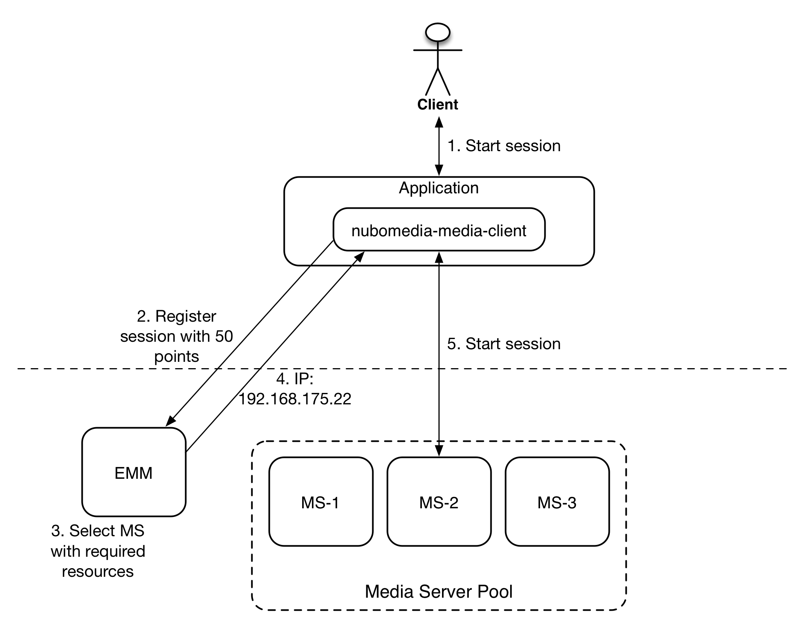
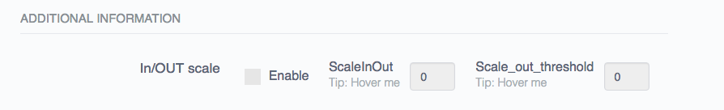

# Autoscaling

The NUBOMEDIA autoscaling system provides an advanced functionality for supporting the runtime execution of Multimedia Applications. In particular, this system provides automated scaling in and out (where scaling in means the removal of existing media plane entities while scaling out means adding new ones) of media plane entities based on the existing number of sessions. In order to provide such functionality NUBOMEDIA Applications must use an extended version of the Kurento-media-client library which communicates with the NUBOMEDIA Control layers whenever a session in instantiated or closed. This thight communication between the control layer and the application allows full control of the media plane instances.

## The NUBOMEDIA Media Client

As mentioned in the previous section, in order to make use of the NUBOMEDIA autoscaling mechanism, the Application should make use of an extended version of the Kurento Media Client. This extended version provides a mechanism for dynamically retrieving KMS instance IPs. The application developer can decide whether to make use of this functionality for each session, therefore having a more granular mechanism for setting up new sessions, or per application. Typically the decision has to be made based on the requirements of the application itself. Furthermore, in order to ensure a certain SLA the EMM keeps track of the KMS capacity using a point mechanism. Depending on its flavor (SMALL, MEDIUM, LARGE) the KMS will be able to handle a certain number of sessions, defined as capacity. Each time a new application requests the EMM for a KMS instance IP it consumes a certain number of points.
We have defined the following capacity: 
* SMALL: 100 points, which means that a KMS instance is able to handle 2 sessions (each session consumes 50 points by default) in parallel
* MEDIUM: 200 points, which means that a KMS instance is able to handle 4 sessions (each session consumes 50 points by default) in parallel
* LARGE: 400 points, which means that a KMS instance is able to handle 8 sessions (each session consumes 50 points by default) in parallel

The following figure shows the behaviour of the application making use of the NUBOMEDIA Media Client APIs for retrieving the KMS IP. 

*NUBOMEDIA Media Client*

1) The user requests the instantiation of a new session
2) The application receives the request and interrogates the EMM via its APIs. Basically the application makes a POST request to the EMM asking for a KMS instance with a specific amount ot points 
3) The EMM receives the request to reserve a KMS instance with a specific amount of points (typically fixed to 50). Optionally, the external Application ID could be passed as well to ensure that the same Application will not be registered multiple times what would mean to occupy resources of Media Components multiple times by the same Application.
4) The EMM sends back the KMS IP to the client
5) The client starts the session with the identified KMS instance

In case there is no capacity left in any KMS instances, the EMM responds to the client with saying that there are no enough resources available for instantiating new sessions.

## How the Elastic Media Manager (EMM) manages KMS instances

As you have learned from the previous section, the EMM decides at runtime which instance of KMS should be used. When The EMM receives the request to register a new application with a specific amount of points, first it checks if there is any KMS instance in the ACTIVE pool that can be assigned to establish a new session. If not, it is taken one from the IDLE pool. The selected KMS (either from the ACTIVE or IDLE pool) that satisfies the requirements of the applicatio (enough points left) is assigned to establish the session. This means, the left capacity (points) of the KMS instance will be updated by reducing the capacity of the KMS instance by the amount of capacity that is requested by the Application. If the Media Component comes originally from the IDLE pool, it will be moved to the ACTIVE pool.

What happens when there is not an enough number of KMS instances available? Typically depends from the autoscaling policy you have selected while deploying your application. As you can remember, the PaaS GUI the option to select scaling in/out:

*Autoscaling option on the PaaS GUI*

First of all, if you want to have more than 1 instance of KMS, you should enable this option. Let's see together what is the meaning of the other parameters: 
* ScaleInOut: defines the number of maximum instances which are going to be created over the time by the autoscaling engine. This means that if you have an increasing number of sessions, the system will instantiate new KMS instances until when this quota is reached. 
* Scale_out_threshold: it represents the threshold which should be used as policy by the autoscaling system for triggering scaling out functionality. This value MUST always be lower than the maximum capacity each KMS instance can offer. 

Let's make an example: you deploy an application and enable the autoscaling option assigning 3 as the scaleInOut value and 110 as the Scale_out_threshold parameter. In addition to this, you selected the MEDIUM flavor, which means that based on the definition given previously each KMS instance will have a capacity of 200 points. 
After the deployment of the application there is only 1 instance of KMS available. When the first client connects it will consume 50 points. The second will increase the consumed capacity to 100. After the third one, which means 150 points, the threshold (110) is passed and therefore the autoscaling system starts the scaling out functionality. Once the new instance is available, the consumed capacity is computed as an average and therefore it decreases to 75 (=150 / 2 instances). New sessions will be placed in the KMS instance having less capacity used. 

Once sessions are closed, the autoscaling engine decides to remove KMS instances only when there are no active sessions anymore. 

