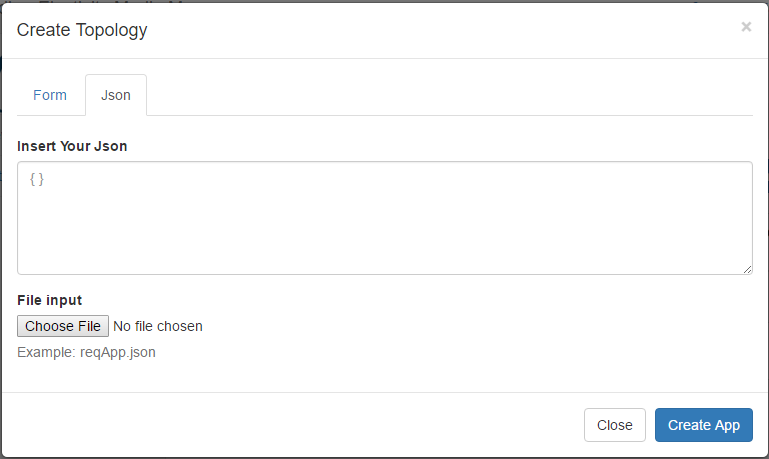

# PaaS Manager APIs

This documentation describes how to use the PaaS Manager via the exposed REST APIs. We'll use a command line HTTP client (curl) for showing the different REST API calls.

## Get a token

In order to request a token, you need to execute the following request: 

```bash
curl -s -u openbatonOSClient:secret -X POST http://localhost:8081/oauth/token 
-H "Accept:application/json" 
-d "username=admin&password=passowrd&grant_type=password“ 
```

Response: 
```json
{
    "additionalInformation": {},
    "expiration": "Sep 28, 2016 6:49:35 AM",
    "refreshToken": {
        "expiration": "Oct 27, 2016 6:49:35 PM",
        "value": "7b7040a2-85cb-4791-b4e4-427f2a2a0afb"
    },
    "scope": [
        "read",
        "write"
    ],
    "tokenType": "bearer",
    "value": "0e8f1ca3-2605-4eae-b229-4f886228b993"
}
```


## Create an Application

In order to create in order words deploy your application on NUBOMEDIA PaaS, it is important that you followed the previous steps provided in the [Guidelines on Building Application](https://github.com/nubomedia/developer-guidelines/blob/develop/docs/paas/paas-introduction.md) in order to understand how to create an application for NUBOMEDIA. If you made all the steps required, you should get at the end a URL of a Git repository where your Dockerfile is contained. See [example](https://github.com/nubomedia/nubomedia-magic-mirror). 

Once you have all files assembled, the *Create App* View on the PaaS Manager GUI provides you two options to create your application: a *Form* view and *JSON* view. Here the *JSON* view is what you wish to use. Explanation on using the *Form* view is found [here](paas-gui.md).

For the *JSON* view, you should see a mask similar to the image below.


*PaaS Manager - Create App - JSON View*

For instantiating this application on the NUBOMEDIA PaaS you should create a JSON object like the following: 

```json
{
	"gitURL": "https://github.com/nubomedia/nubomedia-magic-mirror.git",
	"name": "nubo-magic-mirror",
	"cloudRepository": true,
	"cdnConnector": true,
	"flavor": "MEDIUM",
	"ports": [
	    {
            "port": 8443,
            "targetPort": 8443,
            "protocol": "TCP"
	    },
	    {
            "port": 443,
            "targetPort": 443,
            "protocol": "TCP"
	    }
	],
	"replicasNumber": 2,
	"numberOfInstances": 3,
	"turnServerActivate": true,
	"stunServerActivate": true,
	"stunServerIp": "192.168.1.1",
	"stunServerPort": "8080",
	"turnServerUrl": "localhost:8080",
	"turnServerUsername": "username",
	"turnServerPassword": "password",
	"scaleInOut": 1,
	"scale_out_threshold": 50,
	"qualityOfService": "GOLD",
	"services": [
        {
            "name": "mysql",
            "dockerURL": "registry.access.redhat.com/openshift3/mysql-55-rhel7",
            "replicasNumber": 1,
            "ports": [
                {
                    "port": 3306,
                    "targetPort": 3306,
                    "protocol": "TCP"
                }
            ],
            "envVars": [
                {
                    "name": "MYSQL_USER",
                    "value": "test"
                },
                {
                    "name": "MYSQL_PASSWORD",
                    "value": "1234"
                },
                {
                    "name": "MYSQL_DATABASE",
                    "value": "nubo"
                }
            ]
        }
    ]
}
```

where: 

- ```gitURL```: the Git repository URL that contains your project (source or jar), Dockerfile and other files that are necessary to run your application. If the repository is public the link has to be the HTTPS version, if is private has to be the SSH version

- ```name```: is the name of your application as you would want it to appear on the PaaS. This name is used for creating the DNS entry for your application.

- ```cloudRepository```: Boolean value of ```true``` or ```false``` indicating if your application will be needing the cloud repository (the cloud repository is a running instance of the [Kurento repository server](http://doc-kurento-repository.readthedocs.org/en/latest/server.html) application)

- ```cdnConnector```: Boolean value of ```true``` or ```false``` indicating if your application will be needing the CDN Connector (the CDN Connector is a running instance of the [NUBOMEDIA CDN Connector](https://github.com/nubomedia/nubomedia-cdn-connector), more info at [tutorial CDN Connetor](../tutorial/nubomedia-cdn.md))
 
- ```flavor```: This defines the size of the KMS instances. With MEDIUM flavor, you get 2 VCPU and with LARGE flavor you have 4VCPU. The capacity is defined as 100 points for VCPU.

- ```ports```: Indicate the transport protocol and ports exposed for your application. The port is the port exposed by the container on which your application will be running, and the target port is the external port on which your application is reachable for the outside. So there is a mapping coming on within the PaaS for the port and target port. In principle, you can leave the port and target port the same, unless your application has special requirements.

- ```replicasNumber```: Is a numeric value indicating the number of containers to be created for your application by the PaaS. This value is used for load balancing.

- ```numberOfInstances```: Is a numeric value that defines the number of KMS instances launched at the very beginning.

- ```turnServerActivate```: Boolean value of ```true``` or ```false``` indicating if you want a TURN server to be set on the path of your application

- ```stunServerActivate```: Boolean value of ```true``` or ```false``` indicating if you want a STUN server to be set on the path of your application

- ```stunServerIp```: The IP address of the STUN server you wish to use

- ```stunServerPort```: The port of the SUN server you wish to use

- ```turnServerUrl``` - The IP address and port of the TURN server you wish to use

- ```turnServerUsername```:  The username to be used as credentials to access the TURN server

- ```turnServerPassword```:  The password to be used as credential to access the TURN server

- autoscaling properties (please refer to [this page](autoscaling.md) for more information about autoscaling): 

	- ```scaleInOut```: Scale in or out indicates the MAX number of media servers (KMS) instances that will be instantiates at runtime, by the auto scaling system.

	- ```scale_out_threshold```: This is the threshold (in terms of averaged number of points) which will be used for the policy of the autoscaling system. Check which flavor you are going to use before defining this threshold. 

***Note*** Do not put a value lower than the total capacity of your flavor!

- ```qualityOfService```: If enabled it provides dedicated bandwidth levels between media server instances (optional). Possible values are:

	- ```BRONZE```
	- ```SILVER```
	- ```GOLD```
	
- ```services```: Supporting services for providing additional services used by the main application, e.g. databases and other services provided by docker hub. Information are provided back to the main application based on the name of the application and parameters of this supporting service. The URL to the service (together with other parameters) are available in the main applications composed by the name of the service and the keys of the environment variables. In case of the URL, for instance, ```<NAME>_HOST```.
    - ```name```: Human readable name of the service. Used for composing the name of the environment variables provided back to the main application. See also envVars below
    - ```dockerURL```: URL where the docker image is available, e.g. docker hub
    - ```replicasNumber```: Is a numeric value describing the number of containers deployed by Openshift
    - ```ports```: Indicate the transport protocol and ports exposed for the supporting service
    - ```envVars```: List of key and value pairs that defines the environment variables passed to the supporting service. This environment variables are provided back to the main application combined with the name so that the main application can make use of it, for instance, to make use of the serivce. 

When all values have been entered, click on the *Create App* button below. Your request will be forwarded to the PaaS Manager and you will be directed the a view similar to the image below, which shows you the status to the creation process. ```Status``` gives you the status of the process. You might want to reload this page in case you see no update to the status field. The *Load log* button shows you the real time process status from NUBOMEDIA PaaS.

## Get Application status

In order to check the application status you should send the following request: 

```bash
curl -X GET -H "Authorization: Bearer token-id" 
-H "project-id: your-project-ID" 
-H "Accept:application/json" 
http://localhost:8081/api/v1/nubomedia/paas/app/d4fe1d69-fbe1-413c-835a-b03b36e7a21e
```
where: 
- ```token-id``` can be taken from the request get token executed as before

- ```your-project-ID``` can taken from the dashboard

- ```url``` should be the following http://localhost:8081/api/v1/nubomedia/paas/app/app-id

Example response: 
```json
{
    "cdnConnector": false,
    "cloudRepository": false,
    "createdAt": "Oct 19, 2016 12:37:20 PM",
    "createdBy": "admin",
    "envVars": [
        {
            "name": "MYSQL_MYSQL_PASSWORD",
            "value": "1234"
        },
        {
            "name": "MYSQL_MYSQL_DATABASE",
            "value": "nubo"
        },
        {
            "name": "MYSQL_HOST",
            "value": "lc720bc5f-l673e47be-svc.nubomedia.svc.cluster.local"
        },
        {
            "name": "MYSQL_MYSQL_USER",
            "value": "test"
        }
    ],
    "flavor": "MEDIUM",
    "gitURL": "https://github.com/nubomedia/nubomedia-magic-mirror-jar.git",
    "id": "167dfd1b-53d4-47b4-8274-8127cf2470f2",
    "mediaServerGroup": {
        "hosts": [
            {
                "floatingIp": "80.96.122.100",
                "hostname": "media-server-vnf-l673e47be-945",
                "id": "080affac-0c97-48a9-94dd-aa508043af95",
                "status": "ACTIVE"
            }
        ],
        "id": "8838062b-6d60-42bf-8be4-10291dd3274d",
        "nsdID": "9b52d50a-587a-43b4-ac8d-b96c5c4b2c28",
        "nsrID": "5c1bdf1c-76ee-4f07-8a1f-6bc89d508ec5"
    },
    "name": "magic-mirror-mp",
    "osName": "l673e47be",
    "podList": [
        "l673e47be-dc-1-vn2rm",
        "lc720bc5f-l673e47be-dc-1-82aka"
    ],
    "ports": [
        {
            "id": "0c423f54-6fe8-4788-ba81-12cabb1abce2",
            "port": 8443,
            "protocol": "TCP",
            "targetPort": 8443
        },
        {
            "id": "da32e023-3555-4ae7-be9e-ec65842aa03d",
            "port": 443,
            "protocol": "TCP",
            "targetPort": 443
        }
    ],
    "projectId": "bdb5575d-39d2-477f-90b2-9297b9930310",
    "projectName": "nubomedia",
    "replicasNumber": 1,
    "resourceOK": true,
    "route": "l673e47be.paas.nubomedia.eu",
    "scaleOutLimit": 0,
    "scaleOutThreshold": 0.0,
    "services": [
        {
            "dockerURL": "registry.access.redhat.com/openshift3/mysql-55-rhel7",
            "envVars": [
                {
                    "name": "MYSQL_PASSWORD",
                    "value": "1234"
                },
                {
                    "name": "MYSQL_DATABASE",
                    "value": "nubo"
                },
                {
                    "name": "MYSQL_USER",
                    "value": "test"
                }
            ],
            "id": "6c2ca3fe-648c-4126-a8ab-396c5f1cbe83",
            "name": "mysql",
            "osName": "lc720bc5f-l673e47be",
            "podList": [
                "lc720bc5f-l673e47be-dc-1-82aka"
            ],
            "ports": [
                {
                    "id": "d03df015-4bc0-4e4e-be3d-7e85318d2f23",
                    "port": 3306,
                    "protocol": "TCP",
                    "targetPort": 3306
                }
            ],
            "projectId": "bdb5575d-39d2-477f-90b2-9297b9930310",
            "replicasNumber": 1,
            "route": "lc720bc5f-l673e47be.paas.nubomedia.eu",
            "status": "Running"
        }
    ],
    "status": "RUNNING",
    "stunServerActivate": false,
    "turnServerActivate": false
}
```

## Get Application build debug log

In order to get the application build debug log you can make the following request: 

```bash
curl -X GET -H "Authorization: Bearer token-id" 
-H "project-id: project-id" 
http://localhost:8081/api/v1/nubomedia/paas/app/{app-id}/buildlogs
```

## Get Application logs

In order to get the application log you can make the following request: 

```bash
curl -X GET -H "Authorization: Bearer token-id" 
-H "project-id: project-id" 
http://localhost:8081/api/v1/nubomedia/paas/app/{id}/logs/{podName}
```

## Delete an Application

In order to delete an application you can make the following request: 

```bash
curl -X DELETE -H "Authorization: Bearer token-id" 
-H "project-id: project-id" 
http://localhost:8081//api/v1/nubomedia/paas/app/{id}
```

## Start a media server

In order to stop media server you can make the following request:

```bash
curl -X PUT -H "Authorization: Bearer token-id" 
-H "project-id: project-id" 
http://localhost:8081/api/v2/nubomedia/paas/app/{id}/media-server/{hostname}/start
```

This method adds (if stopped before) the defined media server to the list of available media servers. Afterwards the media server can be used again for registering applications. It won’t execute any scaling action.

## Stop a media server

In order to stop media server you can make the following request:

```bash
curl -X PUT -H "Authorization: Bearer token-id" 
-H "project-id: project-id" 
http://localhost:8081/api/v2/nubomedia/paas/app/{id}/media-server/{hostname}/stop
```

Executing this action removes the defined media server from the list of available media servers. So this media server can not be used anymore for registering new applications. Already registered applications will remain on this media server and can be still unregistered. It won’t execute any scaling action.

## Create (scale out) a media server

In order to add (scaling out) media server(s) you can make the following request:

```bash
curl -X POST -H "Authorization: Bearer token-id" 
-H "project-id: project-id" 
http://localhost:8081/api/v2/nubomedia/paas/app/{id}/media-server
```

The upper number of media server is limited by the parameter ```scaleOutLimit```. Once scaled out, the new media server is available for further application registrations.

## Delete (scale in) a media server

In order to delete (scaling in) media server(s) you can make the following request:

```bash
curl -X DELETE -H "Authorization: Bearer token-id" 
-H "project-id: project-id" 
http://localhost:8081/api/v2/nubomedia/paas/app/{id}/media-server/{hostname}
```

The media server to delete is defined via the hostname. If no hostname is provided, a randomly chosen media server will be removed. The lower number of media server is limited by 1. All registered applications will be removed automatically from the media server.

## Get information of media server(s)

In order to get information about media-server(s) you can make the following request:

```bash
curl -X GET -H "Authorization: Bearer token-id" 
-H "project-id: project-id" 
http://localhost:8081/api/v2/nubomedia/paas/app/{id}/media-server/{hostname}
```

If the hostname is defined, it returns detailed information of the given media-server. If no hostname is provided it returns a list of all media-server available (active and inactive)