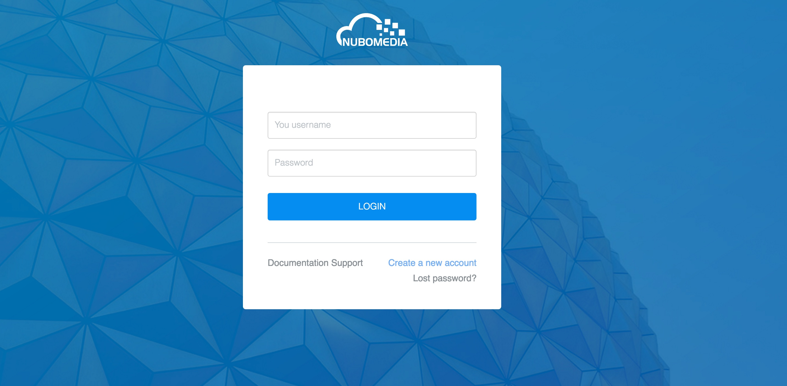
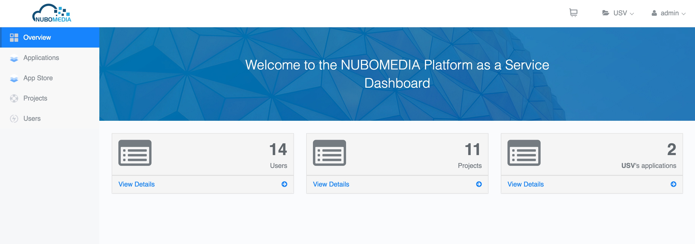
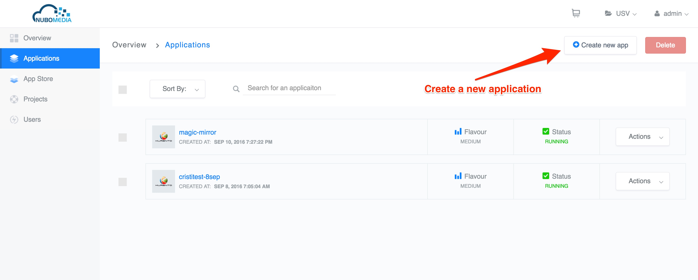
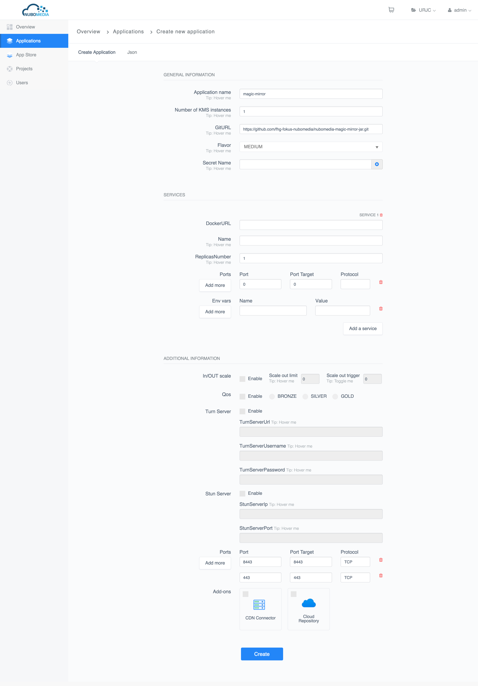
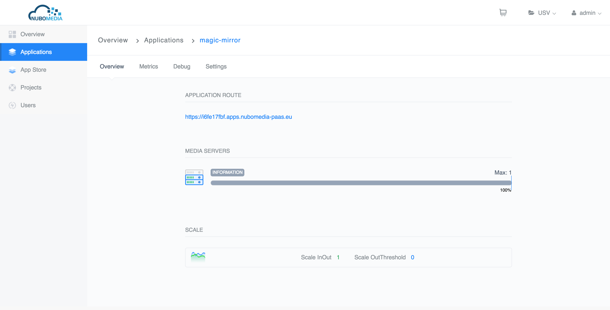
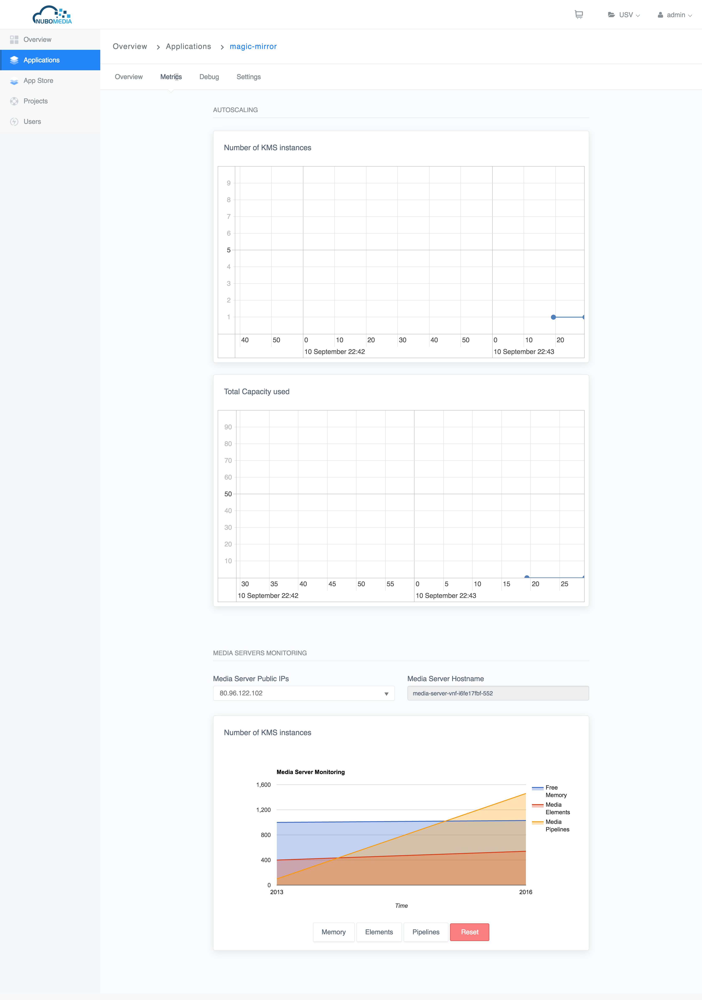
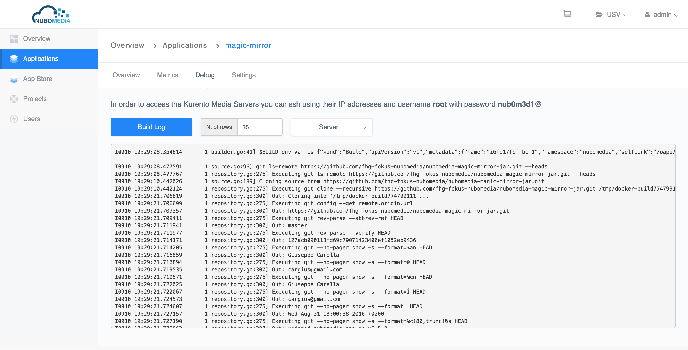
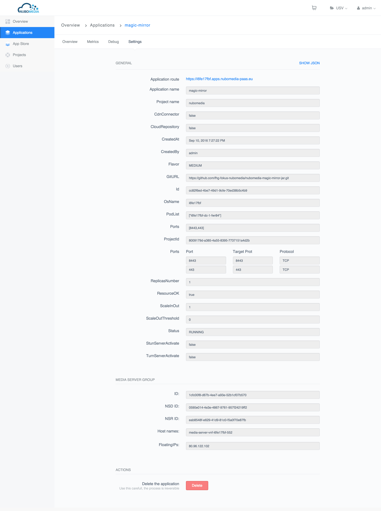

# PaaS Manager

This documentation describes how to use the PaaS Manager via the REST APIs.

## Getting Started

If you want access to the platform [contact us](mailto:nubomedia-dev@googlegroups.com).

## Login

On the login page you have the option to either login, request a new account or reset your passoword.



Once logged in, on the start view, you should see a blue box with the number of already deployed applications. Click on *View Details*. Alternatively on the left hand side menu click on *Applications*. On the next mask above, there is a button *Create App*. The next section explains in details the procedure on creating your application.


*PaaS Manger - Start View*


*PaaS Manager - Create App*

## Create an Application

In order to deploy your application on NUBOMEDIA PaaS, it is important that you followed the previous steps provided in the [Guidelines on Building Application](paas-introduction.md) in order to understand how to create an application for NUBOMEDIA. If you made all the steps required, you should get at the end a URL of a Git repository where your Dockerfile is contained. See [sample example] (https://github.com/nubomedia/nubomedia-magic-mirror).

Once you have all files assembled, the *Create App* View on the PaaS Manager GUI provides you two options to create your application: a *Form* view and *JSON* view. Here the *Form* view is what you wish to use. You can build a *JSON* template of your application following the tutorial [here](paas-api.md) in section Create Application. Once you have the *JSON* file, you can submit it via the GUI.

For the *Form* view, you should see a mask similar to the image below.


*PaaS Manager - Create App - Form View*

where:

-  ```Application name```: is the name of your application as you would want it to appear on the PaaS. This name is used for creating the DNS entry for your application;

-  ```Number of KMS instances```: Indicates the minimum number of media servers that will be available, even if auto-scaling mechanism is used;

- ```GitURL```: the Git repository URL that contains your project (source or jar), Dockerfile and other files that are necessary to run your application. If the repository is public the link has to be the HTTP version, if is private has to be the SSH version;

-  ```flavor```:  This defines the size of the KMS instances. With ```MEDIUM``` flavor, you get 2 VCPU and with ```LARGE``` flavor you have 4VCPU. The capacity is defined as 100 points for VCPU;

-  ```secretName``` (optional): Indicates the name of the secret that has to be used only if your application is on a private Git repository;

-  ```Services``` (optional): Allows you to define add-on services like mysql, rabbitmq, etc;

    -  ```DockerURL```: Represents the link for the Docker file that defines the add-on service;
    
    -  ```Name```: Represents the name of the add-on service;
    
    -  ```Replicas Number```: Represents the number of containers that will run that particular service;
    
    -  ```Ports```: The add-on service might need to expose multiple ports;
    
    -  ```ENV vars```: Are environment variables that should configure the add-on service at start-up;

-  ```Do you want to set the scale IN/OUT threshold?``` if checked then you are given the options to set. Please follow the [autoscaling](autoscaling.md) documentation for more details on how autoscaling works.

    - ```Scale Out Limit```: Scale in or out indicates the MAX number of media servers (KMS) instances that will be instantiates at runtime, by the auto scaling system.

    - ```Scale Out Trigger```: This is the threshold (in terms of averaged number of points) which will be used for the policy of the autoscaling system. CHECK which flavor you are going to use before defining this threshold. 

>>!!! info
    Do not put a value lower than the total capacity of your flavor!

- ```Do you want to set the Quality of Service?``` If checked then you are given the options to set

    - ```qualityOfService```:  If enabled it provides dedicated bandwidth levels between media server instances (optional). Possible values are:

	    - ```BRONZE```
	    - ```SILVER```
	    - ```GOLD```

- ```Do you need a cloud repository for your app?``` Indicates if your application will be needing the cloud repository (the cloud repository is a running instance of the [Kurento repository server](http://doc-kurento-repository.readthedocs.org/en/latest/server.html) application)

- ```Do you want to set the Turn Server?``` If checked then you are given the options to set

    - ```turnServerUrl```: The IP address and port of the TURN server you wish to use

    - ```turnServerUsername```: The username to be used as credentials to access the TURN server

    - ```turnServerPassword```: The password to be used as credentail to access the TURN server

- ```Do you want to set the Stun Server?``` If checked gives you the option to set

    - ```stunServerIp```: The IP address of the STUN server you wish to use

    - ```stunServerPort```: The port of the SUN server you wish to use

    - ```ports```: Indicate the transport protocol and ports exposed for your application. The port is the port exposed by the container on which  your application will be running, and the target port is the external port on which your application is reachable for the outside. So there is a mapping coming on within the PaaS for the port and target port. In principle, you can leave the port and target port the same, unless your application has special requirements. You can add more ports by clicking on the ```+```button.

When all values have been entered, click on the *Create App* button below. Your request will be forwarded to the PaaS Manager and you will be directed the a view similar to the image below, which shows you the status to the creation process. ```Status``` gives you the status of the process. You might want to reload this page in case you see no update to the status field. The *Load log* button shows you the real time process status from NUBOMEDIA PaaS.


*PaaS Manager - Create App - Application status View*

On the Application Overview page you can see the status of your application (CREATING, BUILDING, DEPLOYING, RUNNING). Here you can also adjust the number of Media Server instances supporting your application by clicking on "Add scale out limit", or you can stop, start or remove one running Media Server from your application.

Here you can check the number of media servers running, the autoscaling configurations and also the addons, if you have added a CDN Connector or a Cloud Repository.


*PaaS Manager - Create App - Application metrics View*

On the Application Metrics tab you have some graphs related to the number of KMSs, memory used by each media-server and the number of media elements and media pipelines for each KMS.


*PaaS Manager - Create App - Application debug View*

On this tab you can check application logs, Media Server logs and application build logs.


*PaaS Manager - Create App - Application settings View*

On the Application Settings tab you can check both the configuration parameters that you added at the deployment time. On this tab you can also find the delete button that would trigger the termination of your application.

After you deployed one application you should check it's status on the Applications overview page. Once it's status is ```RUNNING```, your application has been successfully deployed, and it is running on the PaaS. On the Application Overview tab you have the ```route``` which represents the public endpoint of your application.
