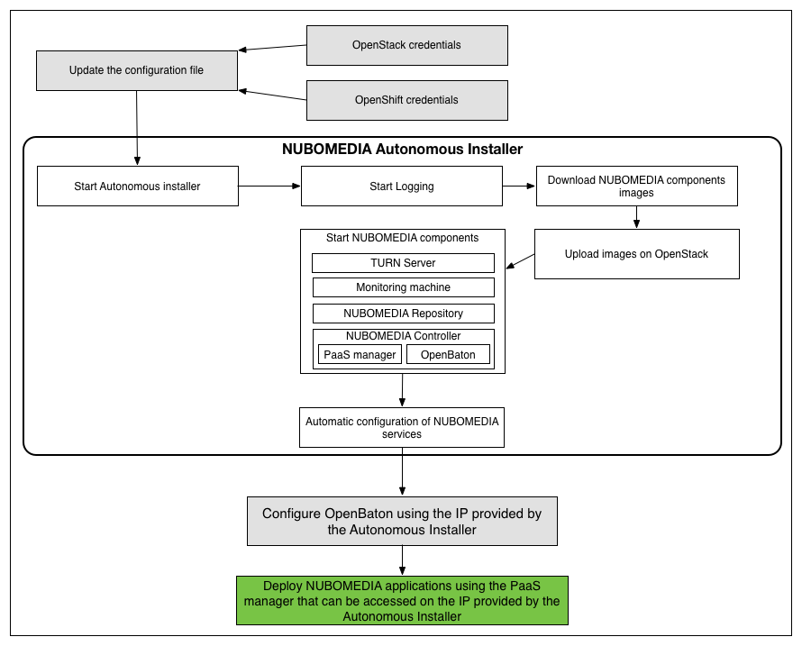

# NUBOMEDIA Autonomous Installer

The NUBOMEDIA Autonomous Installer (NAI) is be able to install the NUBOMEDIA platform into an IaaS environment which has already installed a PaaS system.

The IaaS environment should be based on OpenStack Kilo and have some compute nodes running nova-docker.

The PaaS should be running OpenShift Origin v3 version 3.1 with the following adjustment:

- To relax the security in your cluster so that images are not forced to run as a pre-allocated UID, without granting everyone access to the privileged SCC:
```
oc edit scc restricted
```
Replace the runAsUser with the following:
```
runAsUser:
  type: MustRunAsRange
```

Using the Autonomous Installer we are deploying the following:

- Kurento Media Server images for both KVM and Docker containers; 
- The NUBOMEDIA controller image which hosts: OpenBaton, the Generic VNFM, MS-VNFM and the PaaS Manager; 
- A image hosting TURN and STUN servers; 
- A monitoring machine with the following tools installed: Graphite, Icinga, Logstash; 
- A image hosting the Debian repository with NUBOMEDIA artifacts;

The entire workflow that should be followed in order to successfully deploy the NUBOMEDIA platform is presented in the next diagram.

*NAI Workflow*

## Prerequisites

In order to be able to install the nubomedia-autonomous-installer you have to check that your current Python version is 2.7.XX  with the following command:

```
python --version
```

Then you should install pip and after that you should install the dependencies using the following commands. When asked for any kind read it first and then confirm:

```
easy_install pip
pip install -r requirements.txt --upgrade
```

You should have root access to the OpenStack environment in order to install and configure the nova-docker hypervisor and the patch for it from (https://github.com/nubomedia/nubomedia-nova-docker) on the compute nodes that should run docker as a hypervisor.

## Update the configuration file

Before starting the installation you must rename the *variables-examples.py* to *variables.py*. And then replace each variable with the desired value.

```
mv variables-example.py variables.py
```

### Keystone

```
auth_url = 'http://x.x.x.x:5000/v2.0'
username = 'admin'
password = 'pass'
tenant_name = 'admin'
```
*x.x.x.x* is the public IP address of your OpenStack.

### Glance

```
glance_endpoint = 'http://x.x.x.x:9292'
```
*x.x.x.x* is the public IP address of your OpenStack.

### Master SSH credentials

This step is not needed if you already have nova-docker hypervisors installed on your OpenStack env. and you have applied the patch from the following repository: https://github.com/nubomedia/nubomedia-nova-docker .
```
master_ip = 'x.x.x.x'
master_user = 'root'
master_pass = None
master_key = 'master_id_rsa'
```
*x.x.x.x* is the public IP address of your OpenStack.
*master_user* is a ssh user with root permission on the OpenStack.
For authentication you should either define the *master_pass* as a string variable between quotes or you can copy to the autonomous-installer directory the necessary private key for authentication on the master. The private key should not be password protected.

### Other variables

```
floating_ip_pool = 'external'
private_key = 'private_key_for_accesssing_instances'
openshift_ip = 'x.x.x.x'
```
You should define the floating (public) IP pool name for the OpenStack.
It is best to also add a public key on the OpenStack tenant you want to deploy NUBOMEDIA and then add the private key file to the autonomous-installer directory in order to allow it to customize the instances after deployment.  
*x.x.x.x* represents the public IP address of the OpenShift PaaS.


## NUBOMEDIA images

You should download all the NUBOMEDIA images and store them on the *repository/images/* directory.

### NUBOMEDIA Kurento Media Server - qemu image for KVM
```
kms_qemu_img = 'resources/images/kurento-media-server.qcow2'
kms_image_name = 'kurento-media-server'
kms_image_description = 'Kurento Media Server image for KVM hypervisor'
kms_qemu_flavor = 'm1.medium'
```
Kurento Media Server requires a flavor with at least 2GB of ram, 1 x86_64 CPU and 5GB of disk space.

### NUBOMEDIA Kurento Media Server Docker image for - Docker

```
kms_docker_img = 'nubomedia/kurento-media-server'
kms_docker_image_description = 'Please login with root user and your docker image root password'
kms_docker_flavor = 'd1.medium'
```
The Docker image for kurento-media-server is stored on the NUBOMEDIA dockerhub repository (https://hub.docker.com/r/nubomedia/kurento-media-server/ ).  The minimum flavor type would be at least 2GB of ram, 1 x86_64 CPU and 5GB of disk space.

### NUBOMEDIA Monitoring machine - qemu image for KVM

```
monitoring_qemu_img = 'resources/images/nubomedia-monitoring.qcow2'
monitoring_image_name = 'nubomedia-monitoring'
monitoring_image_description = 'Please login with ubuntu user and your private_key'
monitoring_flavor = 'm1.medium'
```
The NUBOMEDIA Monitoring machine runs logstash, Kibana, and Graphite. All the logs of the media-server instances are stored on this machine. The required flavor for running it should have at least 2GB of ram, 1 x86_64 CPU and 15GB disk space.

### NUBOMEDIA TURN Server machine - qemu image for KVM

```
turn_qemu_img = 'resources/images/nubomedia-turn.qcow2'
turn_image_name = 'nubomedia-turn'
turn_image_description = 'Please login with ubuntu user and your private_key'
turn_flavor = 'm1.small'
```
The TURN Server should have at least 1G of RAM, 1 x86_64 CPU and 5GB disk space.
All the NUBOMEDIA Kurento Media Server instances should be configured to use this server IP for TURN and STUN.

### NUBOMEDIA Repository Server machine - qemu image for KVM

```
repository_qemu_img = 'resources/images/nubomedia-repository.qcow2'
repository_image_name = 'nubomedia-repository'
repository_image_description = 'Please login with ubuntu user and your private_key'
repository_flavor = 'm1.medium'
```
The NUBOMEDIA repository machine hosts the Debian repository and on the http://repository.nubomedia.eu/apps/files/ you have the kurento-tutorial-java repository so you can use it as the APP server for some of the Kurento tutorials. The recommanded configuration is 1G of RAM, 1 x86_64 CPU and 5GB of disk space.

### NUBOMEDIA Conroller machine - qemu image for KVM

```
controller_qemu_img = 'resources/images/nubomedia-controller.qcow2'
controller_image_name = 'nubomedia-controller'
controller_image_description = 'Please login with ubuntu user and your private_key'
controller_flavor = 'm1.xlarge'
```
The NUBOMEDIA Controller instance hosts the VNFM and the NUBOMEDIA PaaS manager. The flavor type of for the nubomedia-controller should have at least 8GB of ram, 2 x86_64 CPU and 10GB disk space.

## Run the installer

After defined all the necessary variables you can start the installer with the following command:
```
python main.py
```
