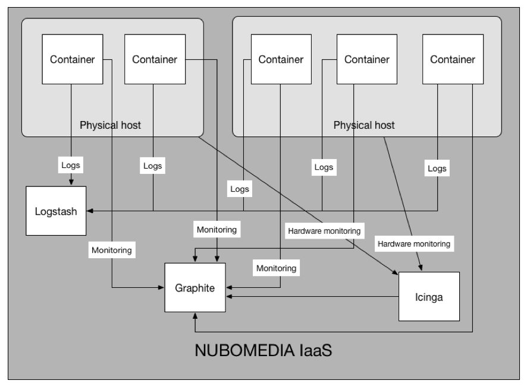
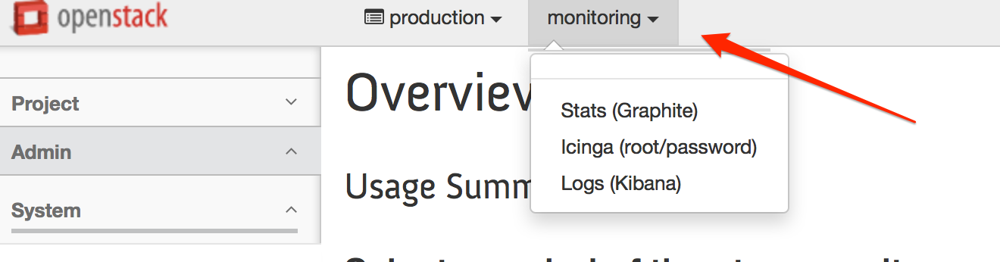
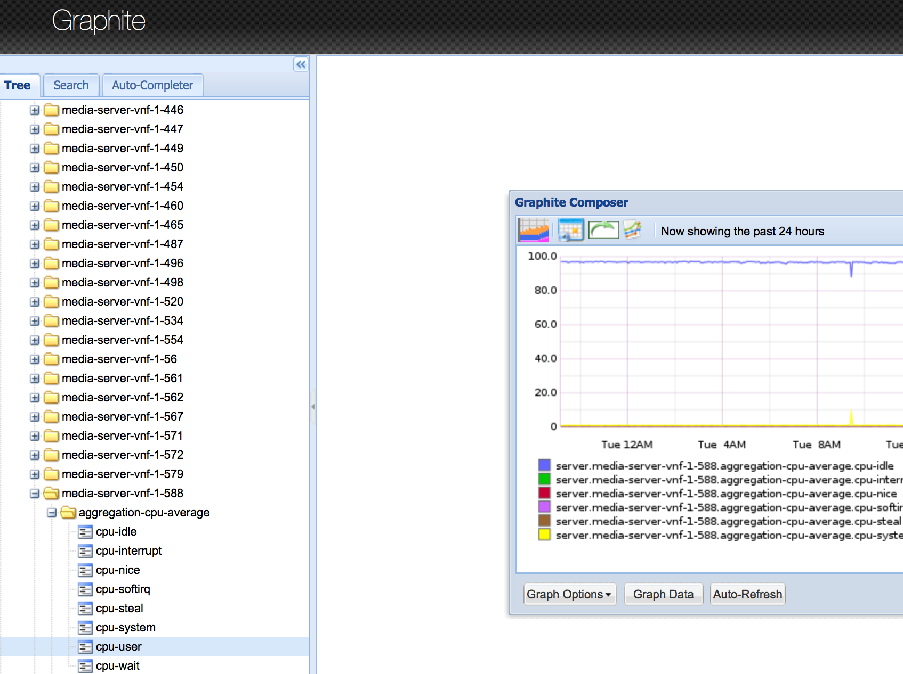
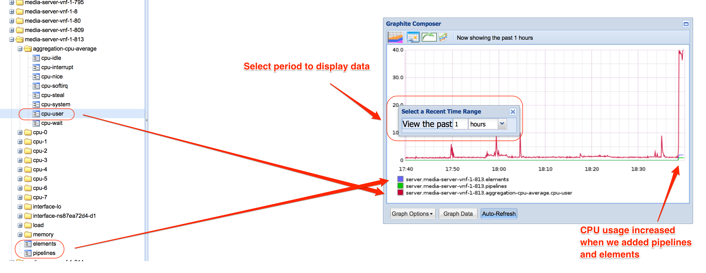
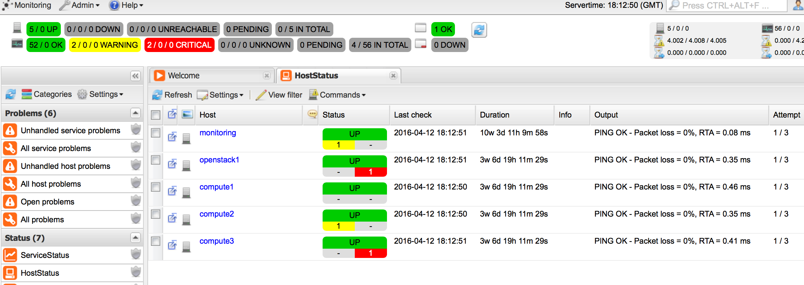
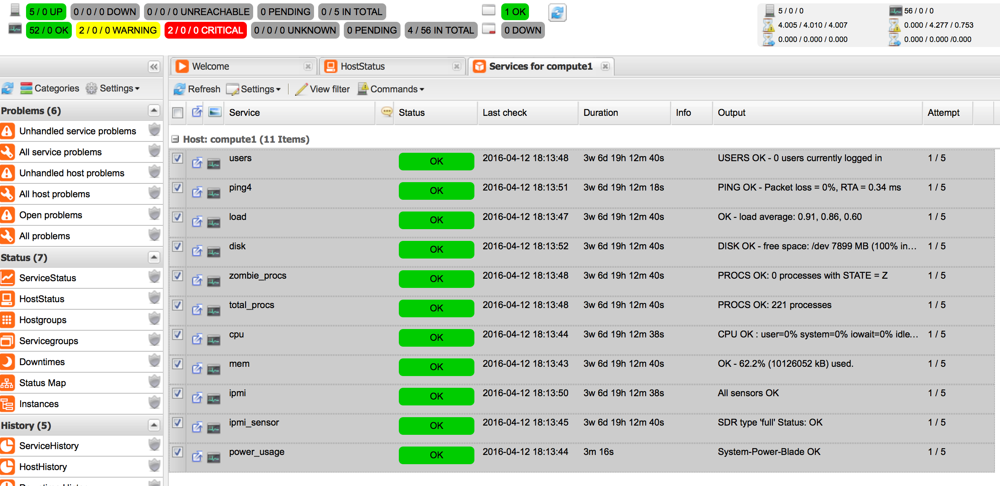

# Monitoring tools

The NUBOMEDIA monitoring tools is a collection of open source software components that monitor the performance of media servers that are running multimedia applications.

Also they monitor the hardware infrastructure that enables NUBOMEDIA operators to optimize the hardware utilization and energy efficiency.

To access the tools you need to login on the production instance of NUBOMEDIA IaaS platform. The NUBOMEDIA project manages a NUBOMEDIA PaaS instance that is reserved to the institutions being part of the project. If you are not part of the NUBOMEDIA project but you want to use NUBOMEDIA you should install your very own PaaS following the [installation instructions](../tools/autonomous-installer.md). 

An architecture of monitoring tools is presented in the following figure:

*Monitoring tools architecture*

## Graphite

The tool is allowing the developers to check the performance of media servers from a visual interface. As displayed in the above architecture, media servers are pushing stats to the Graphite tool.
Once logged on the IaaS platform please access Graphite from top menu:

*NUBOMEDIA IaaS monitoring tools menu*

Access the Stats link and you should start a page similar to:

*Graphite Stats*

On Graphite interface you have to select the server that you want to monitor and choose appropriate stats that should be displayed on the right chart.

How to display advanced stats like number of pipelines and elements we highlighted in the following figure:

*Advanced Stats*

## Icinga

This open source tool is allowing NUBOMEDIA operators to check the status and power efficiency of NUBOMEDIA hardware infrastructure.

After you access the tool from NUBOMEDIA monitoring menu you should see the Icinga overview page:

*Icinga overview*

From overview page please select the specific host that you want to check the status and you should be redirected to the host details page:

*Icinga host details*

