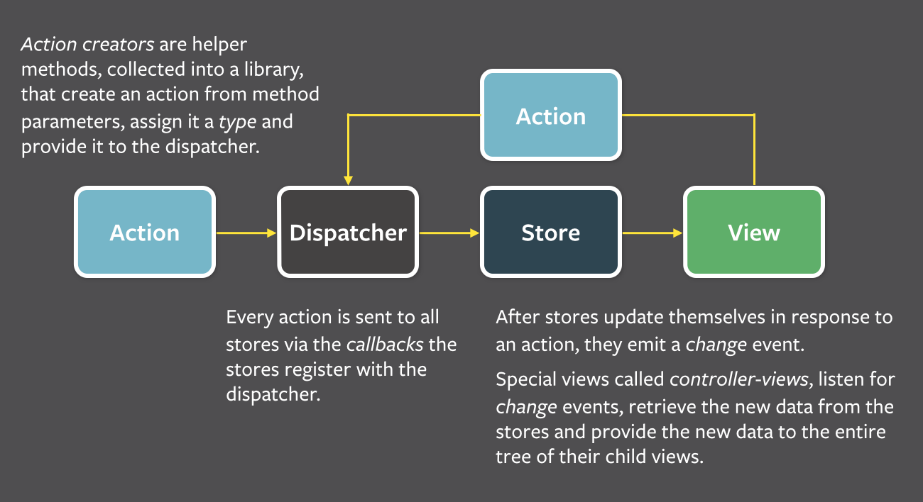
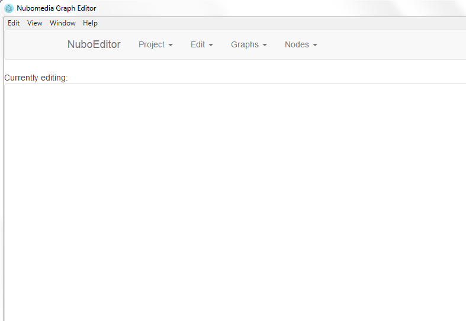
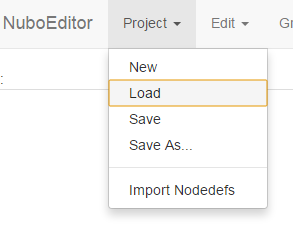
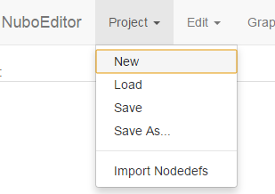
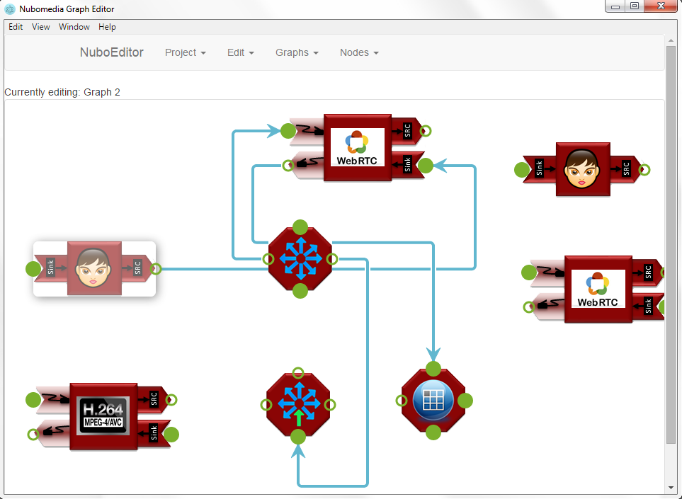
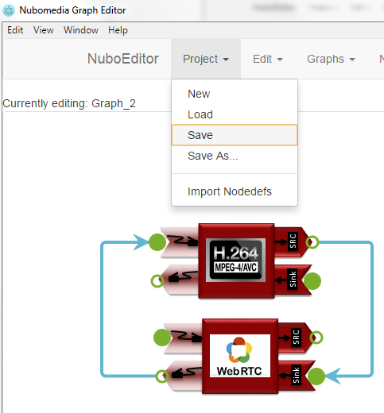
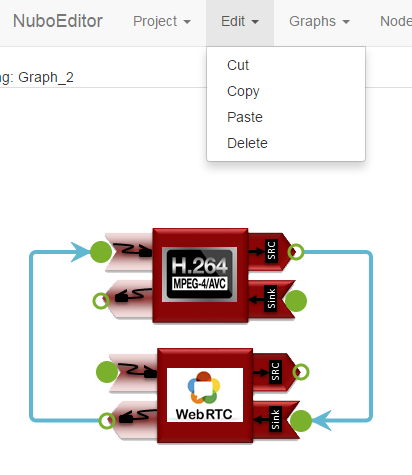
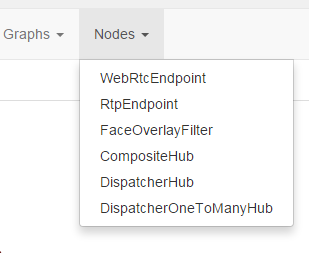

# Visual Development Tool

The NUBOMEDIA Visual Development Tool is composed of two different applications:

- The Graph Editor is a desktop application that lets a developer visually create and edit component graphs and save them as json-based files with the `.ngeprj` file extension.

- The Code Generator is a command-line app that takes `.ngeprj` files and generates source code to implement these graphs in new applications.

The overall architecture is similar to that of Flux, as illustrated in the following figure:

*Flux architecture*

Flux is an "Application Architecture for Building User Interfaces", built by the team at Facebook. It is a set of patterns building larger applications on top of the React component library.

## Graph Editor

The Graph Editor is an HTML app based on Facebook's [React](https://facebook.github.io/react/) and Dan Abramov's [Redux](https://github.com/reactjs/redux) libraries. The main gist of these technologies is to control the flow of data and mutations in an application. Here you can see a collection of the some screenshots of the NUBOMEDIA Graph Editor:

- Starting screen

*NUBOMEDIA Graph Editor. Step 1 - home screen*

- Load an existing Project

*NUBOMEDIA Graph Editor. Step 2 - loading an existing project*

- Create a New Project

*NUBOMEDIA Graph Editor. Step 3 - creating a new project*

- Working with a graph

*NUBOMEDIA Graph Editor. Step 4 - graph creation*

- Saving work on a graph

*NUBOMEDIA Graph Editor. Step 5 – saving a graph*

- Possible actions while working on a graph: Cut, Copy, Paste, Delete can be performed on a given element (node or connection)

*NUBOMEDIA Graph Editor. Step 6 - edit options*

- Nodes available

*NUBOMEDIA Graph Editor. Step 7 – nodes availability*
