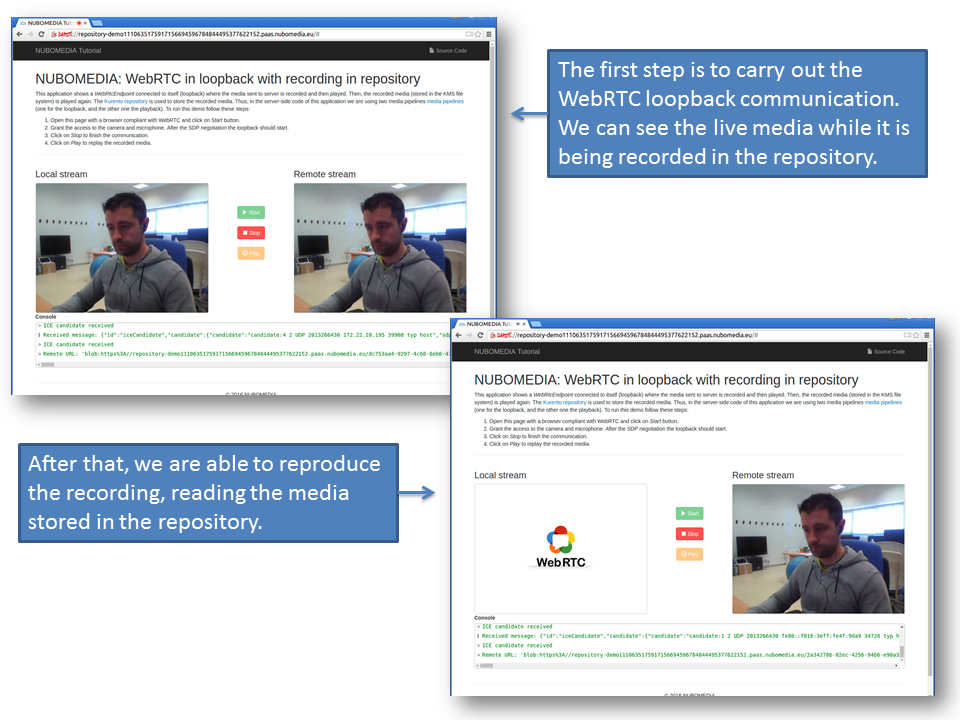
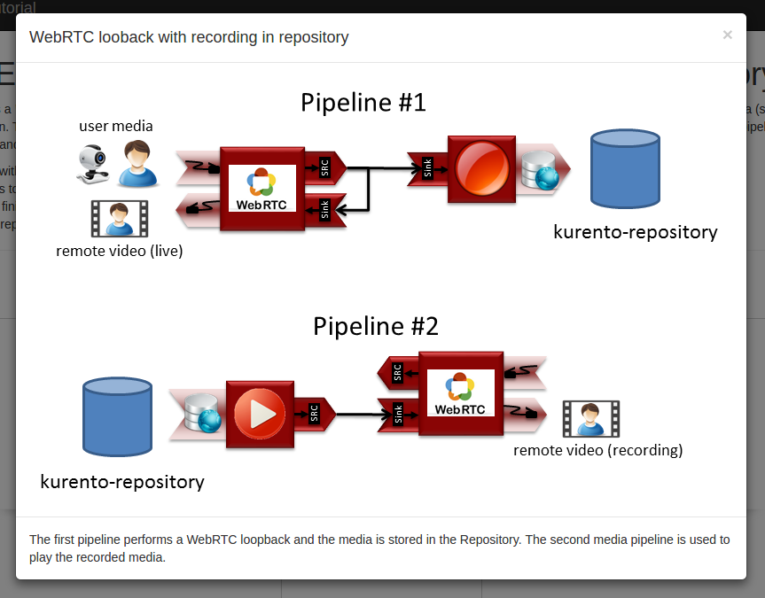
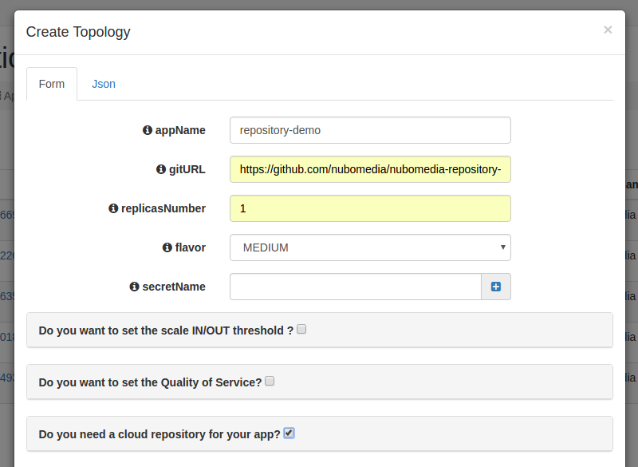

# NUBOMEDIA Repository Tutorial

This application is an example of usage of the [Media API](../api/media.md) in conjunction with the [Repository API](../api/repository.md). This application is based on the [Kurento repository tutorial](http://doc-kurento.readthedocs.org/en/stable/tutorials/java/tutorial-repository.html), adapted to be deployed on the [NUBOMEDIA PaaS](../paas/paas-introduction.md).

## Understanding this example

This web application consists on a WebRTC video communication in loopback, with recording and playback capabilities through the [Kurento Repository](http://doc-kurento-repository.readthedocs.org/). The following picture shows two screenshots of the demo running in a web browser. As can be seen, there are two steps while running the application. First, the WebRTC in loopback is carried out, and the user media is stored in the repository. After that, the recording can be played using WebRTC as transport:



*NUBOMEDIA Repository Screenshots*

Therefore, in this tutorial we are using the [Media API](../api/media.md) to implement two independent **Media Pipelines** in the server-side. The first one is composed by the following **Media Elements**:

- *WebRtcEndpoint*: Provides full-duplex (bidirectional) WebRTC capabilities.

- *RecorderEndpoint*: Media element aimed to store media. In this demo, the [Kurento Repository](http://doc-kurento-repository.readthedocs.org/) is used for this aim, and hence we have to use the [Repository API](../api/repository.md) to access it (Record/Play). 

In the second pipeline there are the following media elements:

- *PlayerEndpoint*: This media element read the media previously recorded in the repository and feeds the *WebRtcEndpoint*.

- *WebRtcEndpoint*: End-point configured in receive-only mode to send the media to the client using WebRTC.



*Repository Tutorial Media Pipelines*

## Looking into the source code

This application is open source (LGPL license) and it is available on [GitHub](https://github.com/nubomedia/nubomedia-repository-tutorial). From a functional point of view, the logic is very similar to the Java version of [Kurento repository tutorial](http://doc-kurento.readthedocs.org/en/stable/tutorials/java/tutorial-repository.html). For further details (server-side, client-side), please visit that documentation.

In order to migrate the existing Kurento application to the NUBOMEDIA cloud, several aspects have to be taken into consideration:

- To add *nubomedia-media-client* and *repository-media-client* as dependencies. As depicted in the [Media API](../api/media.md) and [Repository API](../api/repository.md) sections respectively, these libraries should be included in any Java application which is going to be deployed in the NUBOMEDIA PaaS using the *Kurento Client* (to manage a Kurento Media Server) and the *Kurento Repository Client* (to manage the Kurento Repository). Since this tutorial is created in Maven, the following dependencies should be included in the [pom.xml](https://github.com/nubomedia/nubomedia-repository-tutorial/blob/master/pom.xml):

```xml
<dependency>
    <groupId>de.fhg.fokus.nubomedia</groupId>
    <artifactId>nubomedia-media-client</artifactId>
    <version>1.0.2</version>
</dependency>
<dependency>
    <groupId>de.fhg.fokus.nubomedia</groupId>
    <artifactId>nubomedia-repository-client</artifactId>
    <version>1.0</version>
</dependency>
```

!!! info

    We are in active development. Please take a look to the [Maven Central Repository](http://search.maven.org/) to find out the latest version of the artifacts.

- The way in which the *Kurento Client* is instantiated should be changed. As depicted on [Kurento documentation](http://doc-kurento.readthedocs.org/en/stable/introducing_kurento.html#kurento-api-clients-and-protocol), the Kurento Client is the piece of software aimed to control the **Kurento Media Server (KMS)**. Inside NUBOMEDIA, the instances of KMSs are elastically managed by the platform, scaling in and out depending on the load of the system. In Kurento tutorials, the way of creating Kurento Clients is done by means of Spring Beans, and so, there is a single instance of Kurento Client by application. This makes sense when a single instance of KMS is being used (which is the typical way of working just with Kurento). Inside NUBOMEDIA this is not always true, and therefore we need to create a new instance of *KurentoClient* for every media session. This is implemented in the Java class [UserSession](https://github.com/nubomedia/nubomedia-repository-tutorial/blob/master/src/main/java/eu/nubomedia/tutorial/repository/UserSession.java). As can be seen in the [handler](https://github.com/nubomedia/nubomedia-repository-tutorial/blob/master/src/main/java/eu/nubomedia/tutorial/repository/RepositoryHandler.java), each time a *start* message arrives to the application server, a new [UserSession](https://github.com/nubomedia/nubomedia-repository-tutorial/blob/master/src/main/java/eu/nubomedia/tutorial/repository/UserSession.java) class is created and a new media session is created is created:

```java
  private void start(WebSocketSession session, JsonObject jsonMessage) {
    // User session
    String sessionId = session.getId();
    UserSession user = new UserSession(sessionId, repositoryClient, this);
    users.put(sessionId, user);

    // Media logic for recording
    String sdpOffer = jsonMessage.get("sdpOffer").getAsString();
    String sdpAnswer = user.startRecording(session, sdpOffer);

    // Response message
    JsonObject response = new JsonObject();
    response.addProperty("id", "startResponse");
    response.addProperty("sdpAnswer", sdpAnswer);
    sendMessage(session, new TextMessage(response.toString()));
  }
```

> The instantiation of *KurentoClient* and the media logic (i.e., the media pipeline and the media element connectivity) is done in the method `startRecording` of the [UserSession](https://github.com/nubomedia/nubomedia-repository-tutorial/blob/master/src/main/java/eu/nubomedia/tutorial/repository/UserSession.java) class. In this method we can also notice how the Repository API is used to create a `RepositoryItemRecorder` object is created, aimed to store the media in the repository. 

```java
  public String startRecording(WebSocketSession session, String sdpOffer) {
    // KurentoClient
    kurentoClient = KurentoClient.create();
    log.info("Created kurentoClient (session {})", sessionId);

    // Media pipeline
    mediaPipeline = kurentoClient.createMediaPipeline();
    log.info("Created Media Pipeline for recording {} (session {})", mediaPipeline.getId(),
        sessionId);

    // Repository item (recorder)
    try {
      Map<String, String> metadata = Collections.emptyMap();
      repositoryItemRecorder = repositoryClient.createRepositoryItem(metadata);

    } catch (Exception e) {
      log.warn("Exception creating repositoryItemRecorder", e);

      // This code allows to run the demo in local without a repository server
      repositoryItemRecorder = new RepositoryItemRecorder();
      String id = String.valueOf(System.currentTimeMillis());
      repositoryItemRecorder.setId(id);
      repositoryItemRecorder.setUrl("file:///tmp/" + id + ".webm");
    }

    log.info("Repository item id={}, url={}", repositoryItemRecorder.getId(),
        repositoryItemRecorder.getUrl());

    // Media elements and connectivity
    webRtcEndpoint = new WebRtcEndpoint.Builder(mediaPipeline).build();
    recorderEndpoint = new RecorderEndpoint.Builder(mediaPipeline, repositoryItemRecorder.getUrl())
        .withMediaProfile(MediaProfileSpecType.WEBM).build();
    webRtcEndpoint.connect(webRtcEndpoint);
    webRtcEndpoint.connect(recorderEndpoint);

    // WebRTC negotiation
    String sdpAnswer = performWebRtcNegotiation(session, sdpOffer);

    // Start recording
    recorderEndpoint.record();

    return sdpAnswer;
  }
```

> After that, the second pipeline is executed when the user clicks on the button `Play`in the GUI. At this moment, a `play` message is sent to the server-side [handler](https://github.com/nubomedia/nubomedia-repository-tutorial/blob/master/src/main/java/eu/nubomedia/tutorial/repository/RepositoryHandler.java), and as a result, the method `playRecording` of the [UserSession](https://github.com/nubomedia/nubomedia-repository-tutorial/blob/master/src/main/java/eu/nubomedia/tutorial/repository/UserSession.java) class is invoked:

```java
  public String playRecording(final WebSocketSession session, String sdpOffer) {
    // KurentoClient
    kurentoClient = KurentoClient.create();
    log.info("Created kurentoClient (session {})", sessionId);

    // Media pipeline
    mediaPipeline = kurentoClient.createMediaPipeline();
    log.info("Created Media Pipeline for playing {} (session {})", mediaPipeline.getId(),
        sessionId);

    // Repository item (player)
    RepositoryItemPlayer repositoryItemPlayer = null;
    try {
      repositoryItemPlayer = repositoryClient.getReadEndpoint(repositoryItemRecorder.getId());

    } catch (Exception e) {
      log.warn("Exception creating repositoryItemPlayer", e);

      // This code allows to run the demo in local without a repository server
      repositoryItemPlayer = new RepositoryItemPlayer();
      repositoryItemPlayer.setId(repositoryItemRecorder.getId());
      repositoryItemPlayer.setUrl(repositoryItemRecorder.getUrl());
    }

    // Media elements and connectivity
    webRtcEndpoint = new WebRtcEndpoint.Builder(mediaPipeline).build();
    playerEndpoint = new PlayerEndpoint.Builder(mediaPipeline, repositoryItemPlayer.getUrl())
        .build();
    playerEndpoint.connect(webRtcEndpoint);

    playerEndpoint.addErrorListener(new EventListener<ErrorEvent>() {
      @Override
      public void onEvent(ErrorEvent event) {
        log.info("ErrorEvent for session {}: {}", session.getId(), event.getDescription());

        handler.sendPlayEnd(session);
        release();
      }
    });
    playerEndpoint.addEndOfStreamListener(new EventListener<EndOfStreamEvent>() {
      @Override
      public void onEvent(EndOfStreamEvent event) {
        log.info("EndOfStreamEvent for session {}", session.getId());

        handler.sendPlayEnd(session);
        release();
      }
    });

    // WebRTC negotiation
    String sdpAnswer = performWebRtcNegotiation(session, sdpOffer);

    // Start playing
    playerEndpoint.play();

    return sdpAnswer;
  }
```

> It is very important to release this instance of *KurentoClient* when each media session is finished. This is implemented in the method `release` of this class ([UserSession](https://github.com/nubomedia/nubomedia-repository-tutorial/blob/master/src/main/java/eu/nubomedia/tutorial/repository/UserSession.java)). As can be seen, in this method the media pipeline is also released:

```java
  public void release() {
    log.info("Releasing media pipeline {} (session {})", getMediaPipeline().getId(), sessionId);
    getMediaPipeline().release();

    log.info("Destroying kurentoClient (session {})", sessionId);
    getKurentoClient().destroy();
  }
```

> This release process can be triggered by two events:

>> 1- On the reception of the `stop` message in the [handler](https://github.com/nubomedia/nubomedia-repository-tutorial/blob/master/src/main/java/eu/nubomedia/tutorial/repository/RepositoryHandler.java). This message is sent from the [client-side](https://github.com/nubomedia/nubomedia-repository-tutorial/blob/master/src/main/resources/static/js/index.js) of the application when the user explicitly clicks on the *Stop* button on the GUI:

```javascript
function stop(stopMessage) {
	console.log("Stopping video call ...");
	setState(I_CAN_START);
	if (webRtcPeer) {
		webRtcPeer.dispose();
		webRtcPeer = null;

		if (stopMessage == undefined || stopMessage) {
		    var message = {
			    id : 'stop'
		    }
		    sendMessage(message);
		}
	}
	hideSpinner(videoInput, videoOutput);
}
```

>> 2- When the WebSocket used for signaling between the client and server-side is closed. This event is captured in the [handler](https://github.com/nubomedia/nubomedia-repository-tutorial/blob/master/src/main/java/eu/nubomedia/tutorial/repository/RepositoryHandler.java) as follows:

```javascript
  @Override
  public void afterConnectionClosed(WebSocketSession session, CloseStatus status) throws Exception {
    log.info("Closed websocket connection of session {}", session.getId());
    release(session);
  }
```

>> To handle correctly the WebSocket close, in the [client-side](https://github.com/nubomedia/nubomedia-repository-tutorial/blob/master/src/main/resources/static/js/index.js), the event `onbeforeunload` is captured to close explicitly the WebSocket. This happens for example when user closes directly the browser (instead of clicking the *Stop* button). In the end this a web application, and that situation is very usual. Thus, the application should be implemented properly to release the resources.

```javascript
var ws = new WebSocket('wss://' + location.host + '/repository');

window.onbeforeunload = function() {
	ws.close();
}
```

- The way in which the *Kurento Repository Client* is the same than in [Kurento repository tutorial](http://doc-kurento.readthedocs.org/en/stable/tutorials/java/tutorial-repository.html). Due to the repository instance is unique in the NUBOMEDIA PaaS, we also need an single instance of the `RepositoryClient`. In this example, this is done by means of a Spring Bean (see [RepositoryApp](https://github.com/nubomedia/nubomedia-repository-tutorial/blob/master/src/main/java/eu/nubomedia/tutorial/repository/RepositoryApp.java) class):    

```java
  @Bean
  public RepositoryClient repositoryServiceProvider() {
    return RepositoryClientProvider.create();
  }
```

## Deployment

The deployment of this application can be done by means of the PaaS Manager directly from the source code hosted on GitHub. To do that, first of all we need to define a [Dockerfile](https://github.com/nubomedia/nubomedia-repository-tutorial/blob/master/Dockerfile) inside our project. 

```
FROM nubomedia/apps-baseimage:src

MAINTAINER Nubomedia

ADD keystore.jks /
ADD . /home/nubomedia

RUN sudo chown -R nubomedia /home/nubomedia
RUN cd /home/nubomedia && mvn compile

ENTRYPOINT cd /home/nubomedia && mvn exec:java
```

Examining the  content of this file, we can how the content of the project is included into the platform:

* `ADD . /home/nubomedia`: This line includes the whole content of the project.
* `ADD keystore.jks /`: This line includes the the Java keystore to the root. This is required to serve the application by HTTPS, which is mandatory in the latest version of WebRTC in browsers. 

After that, several Maven command are configured:

* `RUN cd /home/nubomedia && mvn compile`: Compile the project.
* `ENTRYPOINT cd /home/nubomedia && mvn exec:java`: Run the deployed application.


At this point, we are able to deploy our application in NUBOMEDIA. To that aim, we can use the [PaaS Manager GUI](http://paas-manager.nubomedia.eu:8081/#/) (please visit the [PaaS Manager GUI section](../paas/paas-api.md) for further details).

!!! info

    The access to the PaaS Manager should be done with authentication credentials (login/password). So far, this access is restricted. If your are interested in getting access, please send an email to the [nubomedia-dev](https://groups.google.com/forum/#!forum/nubomedia-dev) list asking for permission.

Once logged in the PaaS Manager, first we have to click on the *Create App* button inside the *Applications* section. It is very important to define the [GitHub URL](https://github.com/nubomedia/nubomedia-repository-tutorial) in which the project is hosted. In this example, we are not using the scaling mechanisms and a single number of replicas. Finally, it is very important to mark the checkbox "**Do you need a cloud repository for your app?**", since the repository it is a requirement for the application: 



*PaaS Manager Settings for Repository Tutorial*

We can check out the building log by clicking the *Build log* button. If everything goes fine, our application should move to the *RUNNING* state. In that case, our application will be up and running inside NUBOMEDIA. In this case, we are able to trace our application logs by clicking on the *App log* button.
