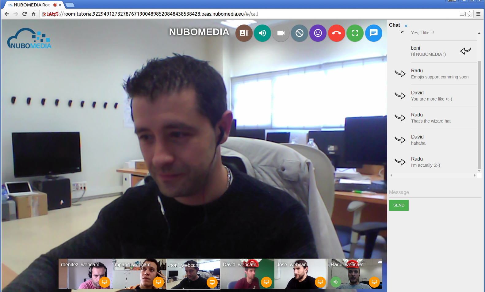
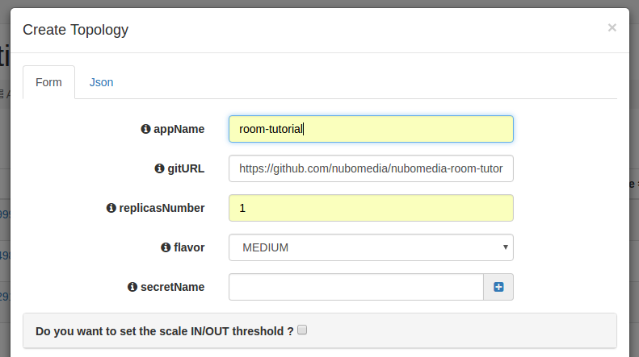

# NUBOMEDIA Room Tutorial

This application is an example of usage of the [Room API](../api/room.md). This application is based on the [Kurento room-demo tutorial](http://doc-kurento-room.readthedocs.org/en/stable/room_demo_tutorial.html), adapted to be deployed on the [NUBOMEDIA PaaS](../paas/paas-introduction.md).

## Understanding this example

This tutorial is a guide for developing a WebRTC multiconference application using the NUBOMEDIA Room API. The following picture shows a screenshot of the demo running in a web browser:



*NUBOMEDIA Room Tutorial Screenshot*

## Looking into the source code

This application is open source (LGPL license) and it is available on [GitHub](https://github.com/nubomedia/nubomedia-room-tutorial). From a functional point of view, the logic is very similar to the Java version of [Kurento room-demo tutorial](http://doc-kurento-room.readthedocs.org/en/stable/room_demo_tutorial.html). For further details (server-side, client-side), please visit that documentation.

In order to migrate the existing Kurento application to the NUBOMEDIA cloud, several aspects have to be taken into consideration:

- To add *nubomedia-media-client* as dependency. As depicted in the [Media API](../api/media.md) section, this library should be included in any Java application which is going to be deployed in the NUBOMEDIA PaaS. Since this tutorial is created in Maven, the following dependency should be included in the [pom.xml](https://github.com/nubomedia/nubomedia-magic-mirror/blob/master/pom.xml):

```xml
<dependency>
    <groupId>de.fhg.fokus.nubomedia</groupId>
    <artifactId>nubomedia-media-client</artifactId>
    <version>6.5.0</version>
</dependency>
```

!!! info

    We are in active development. Please take a look to the [Maven Central Repository](http://search.maven.org/) to find out the latest version of the artifacts.

- To add *kurento-room* dependencies (*kurento-room-server* and *kurento-room-client-js*) dependencies. In addition, this demo uses the *kms-datachannelexample* module, which is media server plugin aimed to read the data from the WebRtc data channels and overlay these data in the media. Therefore, we also need to include the *datachannelexample* Maven dependency:

```xml
<dependency>
	<groupId>org.kurento</groupId>
	<artifactId>kurento-room-server</artifactId>
</dependency>
<dependency>
	<groupId>org.kurento</groupId>
	<artifactId>kurento-room-client-js</artifactId>
</dependency>
<dependency>
	<groupId>org.kurento.module</groupId>
	<artifactId>datachannelexample</artifactId>
</dependency>
```

- The way in which the *Kurento Client* is instantiated should be changed. As depicted on [Kurento documentation](http://doc-kurento.readthedocs.org/en/stable/introducing_kurento.html#kurento-api-clients-and-protocol), the Kurento Client is the piece of software aimed to control the **Kurento Media Server (KMS)**. Inside NUBOMEDIA, the instances of KMSs are elastically managed by the platform, scaling in and out depending on the load of the system. Therefore we need to create a new instance of *KurentoClient* for every room. As depicted on [Kurento Room documentation](http://doc-kurento-room.readthedocs.org/en/stable/room_demo_tutorial.html), in order to control the *KurentoClient* creation, an instance of the interface *KurentoClientProvider* should be provided. This can be done easily extending the class *KmsManager*. The code of this [class](https://github.com/nubomedia/nubomedia-room-tutorial/blob/master/src/main/java/eu/nubomedia/tutorial/room/SingleKmsManager.java) is the following:

```java
public class SingleKmsManager extends KmsManager {

  @Override
  public KurentoClient getKurentoClient(KurentoClientSessionInfo sessionInfo) throws RoomException {
    return KurentoClient.create();
  }

  @Override
  public boolean destroyWhenUnused() {
    return true;
  }

}
```

> Notice that every time that the method `getKurentoClient` is invoked, a new instance of `KurentoClient` is generated. In addition, it is also important to override the method `destroyWhenUnused`, to assure that each `KurentoClient` is released when there is no participants in the room. This manager is used in the class [NubomediaRoomApp](https://github.com/nubomedia/nubomedia-room-tutorial/blob/master/src/main/java/eu/nubomedia/tutorial/room/NubomediaRoomApp.java), which can be seen as the Spring Boot main class for the application.

```java
public class NubomediaRoomApp extends KurentoRoomServerApp {

  @Override
  public KmsManager kmsManager() {
    return new SingleKmsManager();
  }

  @Override
  public JsonRpcUserControl userControl() {
    return new NubomediaRoomUserControl(roomManager());
  }

  public static void main(String[] args) throws Exception {
    SpringApplication.run(NubomediaRoomApp.class, args);
  }
}
```

- Enable the data channels support in the client-side of the room application. This should be done setting the flag *data* to *true* the local stream configuration (see [loginController.js](https://github.com/nubomedia/nubomedia-room-tutorial/blob/master/src/main/resources/static/angular/login/loginController.js)):

```javascript
var kurento = KurentoRoom(wsUri, function (error, kurento) {
	if (error) return console.log(error);

	room = kurento.Room({
		room: $scope.roomName,
		user: $scope.userName,
		updateSpeakerInterval: $scope.updateSpeakerInterval,
		thresholdSpeaker: $scope.thresholdSpeaker
	});

	var localStream = kurento.Stream(room, {
		audio: true,
		video: true,
		data: true
	});

	// Handle events

	localStream.init();
});
```

## Deployment

The deployment of this application can be done by means of the PaaS Manager directly from the source code hosted on GitHub. To do that, first of all we need to define a [Dockerfile](https://github.com/nubomedia/nubomedia-room-tutorial/blob/master/Dockerfile) inside our project. 

```
FROM nubomedia/apps-baseimage:src

MAINTAINER Nubomedia

ADD . /home/nubomedia

ENTRYPOINT cd /home/nubomedia && mvn spring-boot:run
```

Examining the content of this file, we find out how the content of the project is included into the platform:

* `ADD . /home/nubomedia`: This line includes the whole content of the project in the container.

After that, we set the Maven command to run the application:

* `ENTRYPOINT cd /home/nubomedia && mvn spring-boot:run`: Run the Spring-Boot application.


At this point, we are able to deploy our application in NUBOMEDIA. To that aim, we can use the [PaaS Manager GUI](../paas/paas-api.md).

!!! info

    The access to the PaaS Manager should be done with authentication credentials (login/password). The NUBOMEDIA project manages a NUBOMEDIA PaaS instance that is reserved to the institutions being part of the project. If you are not part of the NUBOMEDIA project but you want to use NUBOMEDIA you should install your very own PaaS following the [installation instructions](../tools/autonomous-installer.md).

Once logged in the PaaS Manager, first we have to click on the *Create App* button inside the *Applications* section. It is very important to define the [GitHub URL](https://github.com/nubomedia/nubomedia-room-tutorial) in which the project is hosted. In this example, we are not using the scaling mechanisms and a single number of replicas:



*PaaS Manager Settings for Room Tutorial*

We can check out the building log by clicking the *Build log* button. If everything goes fine, our application should move to the *RUNNING* state. In that case, our application will be up and running inside NUBOMEDIA. In this case, we are able to trace our application logs by clicking on the *App log* button.
